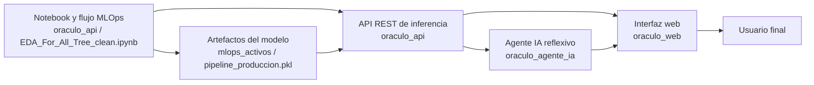
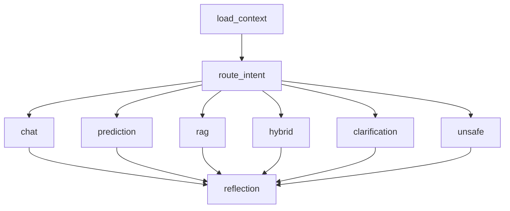

# 🔮 Proyecto Oráculo

<p align="center">
  
  
  
  
  
  
  
</p>

<p align="center">
  <strong>Un workspace maestro para entrenamiento MLOps, exposición de inferencia, orquestación agentic y experiencia web unificada.</strong>
</p>

---

## ✨ Qué es este repositorio

**Proyecto Oráculo** no es un solo backend ni una sola demo.  
Es un ecosistema completo donde conviven cuatro capas principales:

1. **La capa analítica y MLOps**, donde se entrena, valida y exporta el pipeline del modelo.
2. **La capa API**, que convierte ese pipeline en un servicio HTTP autenticado, trazable y utilizable por otros consumidores.
3. **La capa agentic**, que interpreta lenguaje natural, decide intenciones y combina predicción con recuperación documental.
4. **La capa web**, que unifica la experiencia para el usuario final sin obligarlo a manipular tokens o llamar servicios manualmente.

En la práctica, este repositorio reúne el ciclo completo:

- limpieza, transformación y entrenamiento del modelo;
- endurecimiento del puente notebook → producción;
- autenticación, JWT, persistencia e historial de predicciones;
- memoria conversacional, RAG y reflexión del agente;
- una interfaz web lista para operar todo el stack desde un solo punto.

---

## 🧭 Visión general de la arquitectura



---

## 🗂️ Mapa del repositorio

```text
Proyecto_modelo_IA/
├── oraculo_api/
│   ├── app/
│   ├── alembic/
│   ├── tests/
│   ├── requirements.txt
│   ├── .env.example
│   ├── Dockerfile
│   ├── README.md
│   ├── adult.csv
│   ├── compas-scores-raw.csv
│   └── EDA_For_All_Tree_clean.ipynb
├── oraculo_agente_ia/
│   ├── app/
│   ├── knowledge_base/
│   ├── scripts/
│   ├── tests/
│   ├── requirements.txt
│   ├── .env.example
│   ├── Dockerfile
│   └── README.md
├── oraculo_web/
│   ├── app/
│   │   ├── static/
│   │   ├── main.py
│   │   ├── gateway.py
│   │   ├── config.py
│   │   └── schemas.py
│   ├── tests/
│   ├── requirements.txt
│   ├── .env.example
│   ├── Dockerfile
│   └── README.md
├── mlops_activos/
├── _tmp_nb_cells/
├── README.md
└── artefactos y archivos auxiliares del workspace
```

---

## 🧱 Qué hace cada módulo

### `oraculo_api/` — Backend de inferencia y seguridad

`oraculo_api` es la frontera de producción entre el notebook y cualquier consumidor externo.  
Su responsabilidad no es solo devolver una predicción: también centraliza autenticación, persistencia, validación de payloads, auditoría de inferencias y disponibilidad operativa.

**Responsabilidades principales:**

- exponer endpoints REST versionados;
- registrar usuarios y emitir JWT;
- validar el payload del caso Adult Income;
- cargar el artefacto de modelo configurado en `app/ml/pipeline_produccion.pkl`;
- devolver predicciones con probabilidad, metadatos y trazabilidad;
- guardar historial por usuario;
- proteger el acceso con middlewares y contratos estrictos.

**Subcapas internas:**

- `app/api/`: routers y endpoints
- `app/core/`: configuración, errores, middleware, logging y seguridad
- `app/db/`: base ORM, sesión, modelos y repositorios
- `app/services/`: lógica de negocio
- `app/ml/`: cargador del artefacto y compatibilidad notebook → runtime
- `app/schemas/`: contratos Pydantic
- `alembic/`: migraciones

---

### `oraculo_agente_ia/` — Capa agentic, RAG y memoria

`oraculo_agente_ia` es la capa inteligente del ecosistema.  
No sustituye el backend clásico: lo orquesta.

Recibe lenguaje natural, detecta si el usuario quiere:

- conversar,
- pedir una predicción,
- consultar documentación,
- combinar predicción + explicación documental,
- o si está haciendo una solicitud insegura.

Luego ejecuta un flujo stateful con **LangGraph**, consulta su base documental en **Qdrant**, recuerda contexto útil y, cuando corresponde, llama a `oraculo_api` para obtener una predicción real.

**Responsabilidades principales:**

- routing por intención;
- extracción de campos de predicción;
- gestión de `thread_id` y continuidad conversacional;
- memoria corta y memoria semántica;
- reindexado documental;
- RAG con citas;
- reflexión final de la respuesta antes de entregarla.

**Subcapas internas:**

- `app/agent/`: grafo, routing, reflexión, contrato de predicción, tipos
- `app/api/`: endpoints de chat, threads, health y knowledge admin
- `app/clients/`: cliente hacia `oraculo_api`
- `app/memory/`: persistencia y búsqueda semántica de recuerdos
- `app/rag/`: indexación y retrieval
- `app/services/`: fachada de negocio del agente
- `app/db/`: hilos, mensajes, memorias y fuentes documentales
- `scripts/`: tareas operativas, como reindexado manual

---

### `oraculo_web/` — Experiencia web unificada

`oraculo_web` es la capa de experiencia.  
No es un frontend aislado ni un backend pesado: es una web servida con **FastAPI** que actúa como gateway y controla la sesión del usuario.

Su función es evitar que la persona final tenga que:

- loguearse por Swagger,
- copiar tokens,
- llamar endpoints manualmente,
- o alternar entre la API y el agente.

**Responsabilidades principales:**

- registrar e iniciar sesión contra `oraculo_api`;
- guardar la sesión en cookie server-side;
- reenviar el bearer al agente;
- exponer una interfaz “chat-first” con AdultBot;
- mantener el `thread_id` en `localStorage`;
- permitir carga de documentos al knowledge base;
- mostrar respuestas de chat, predicción, RAG o híbridas.

**Subcapas internas:**

- `app/main.py`: app FastAPI y endpoints internos de la web
- `app/gateway.py`: proxy hacia `oraculo_api` y `oraculo_agente_ia`
- `app/config.py`: settings
- `app/schemas.py`: contratos internos
- `app/static/`: `index.html`, `app.js`, `styles.css`

---

## 🔄 Flujo operativo end-to-end

### 1) Entrenamiento y endurecimiento del modelo

El trabajo analítico parte del notebook `EDA_For_All_Tree_clean.ipynb`, junto con datasets como `adult.csv` y `compas-scores-raw.csv`.

En esta capa se define:

- limpieza y normalización;
- ingeniería de variables;
- artefactos auxiliares;
- ensamblaje del pipeline de producción;
- y serialización del modelo para consumo posterior.

---

### 2) Exposición del modelo vía `oraculo_api`

Una vez endurecido el flujo, `oraculo_api`:

- carga el modelo al iniciar;
- registra un usuario técnico admin opcional si así se configura;
- levanta la base local o remota;
- expone endpoints de auth, health y predicción;
- registra cada inferencia con `request_id`, IP, latencia, hash del payload y versión del modelo.

---

### 3) Orquestación conversacional vía `oraculo_agente_ia`

Cuando el usuario conversa con AdultBot:

- el agente carga el contexto del hilo;
- consulta memorias previas;
- decide la intención principal;
- si es predicción, reúne slots faltantes;
- si es pregunta documental, usa RAG;
- si es híbrido, combina ambos;
- luego pasa la respuesta por un critic de reflexión;
- y persiste mensajes, metadatos y memoria semántica.

---

### 4) Experiencia final vía `oraculo_web`

La web:

- autentica al usuario contra `oraculo_api`;
- almacena la sesión;
- reenvía el token al agente;
- presenta quick actions y una UI visual;
- renderiza predicciones, citas y flags;
- y mantiene el hilo conversacional entre turnos.

---

## 🚀 Cómo levantar el proyecto completo

> Este repositorio no usa un único `requirements.txt` raíz.  
> Cada submódulo instala sus propias dependencias porque cada servicio tiene responsabilidades distintas.

### Requisitos previos

- Python **3.11+**
- `pip`
- conexión de red para instalaciones
- opcionalmente Docker
- opcionalmente claves LLM para el agente

---

## 🧪 Orden recomendado de arranque

Para levantar el stack completo de forma local, el orden recomendado es:

1. `oraculo_api`
2. `oraculo_agente_ia`
3. `oraculo_web`

Esto es importante porque:

- el agente depende de la API de inferencia;
- la web depende de la API y del agente;
- si uno de los servicios upstream no está listo, el siguiente se degradará o fallará.

---

# 1️⃣ Instalación y ejecución de `oraculo_api`

## Dependencias declaradas en `oraculo_api/requirements.txt`

### API / Runtime

| Paquete            | Rol                                        |
| ------------------ | ------------------------------------------ |
| `fastapi`          | framework principal de la API              |
| `uvicorn`          | servidor ASGI                              |
| `httptools`        | aceleración del parser HTTP                |
| `watchfiles`       | recarga en desarrollo                      |
| `websockets`       | soporte de transporte en el stack ASGI     |
| `python-multipart` | manejo de formularios y payloads multipart |

### Configuración / Seguridad

| Paquete             | Rol                         |
| ------------------- | --------------------------- |
| `bcrypt`            | hashing de contraseñas      |
| `PyJWT`             | emisión y validación de JWT |
| `pydantic`          | validación de contratos     |
| `pydantic-settings` | settings por entorno        |
| `python-dotenv`     | carga de `.env`             |

### Base de datos / ORM / Migraciones

| Paquete      | Rol                     |
| ------------ | ----------------------- |
| `SQLAlchemy` | ORM principal           |
| `alembic`    | migraciones versionadas |

### Machine Learning / Data

| Paquete        | Rol                             |
| -------------- | ------------------------------- |
| `joblib`       | carga del artefacto serializado |
| `lightgbm`     | backend del modelo              |
| `numpy`        | cómputo numérico                |
| `pandas`       | manipulación tabular            |
| `scikit-learn` | pipeline de ML                  |
| `scipy`        | utilidades científicas          |

### Testing

| Paquete          | Rol                               |
| ---------------- | --------------------------------- |
| `httpx`          | cliente HTTP y soporte de testing |
| `pytest`         | framework de pruebas              |
| `pytest-asyncio` | soporte async en tests            |

## Instalación

### Windows PowerShell

```powershell
cd .\oraculo_api
python -m venv .venv
.venv\Scripts\activate
pip install -r requirements.txt
copy .env.example .env
```

### Linux / macOS

```bash
cd oraculo_api
python -m venv .venv
source .venv/bin/activate
pip install -r requirements.txt
cp .env.example .env
```

## Variables importantes de entorno

- `ORACULO_DATABASE_URL`
- `ORACULO_MODEL_PATH`
- `ORACULO_JWT_SECRET_KEY`
- `ORACULO_ALLOWED_HOSTS`
- `ORACULO_CORS_ALLOW_ORIGINS`
- `ORACULO_MAX_REQUEST_SIZE_BYTES`
- `ORACULO_RATE_LIMIT_ENABLED`
- `ORACULO_RATE_LIMIT_REQUESTS`
- `ORACULO_RATE_LIMIT_WINDOW_SECONDS`
- `ORACULO_DOCS_ENABLED`
- `ORACULO_AUTO_SEED_ADMIN`
- `ORACULO_SEED_ADMIN_EMAIL`
- `ORACULO_SEED_ADMIN_PASSWORD`

## Migraciones

```bash
alembic upgrade head
```

## Arranque local

```bash
uvicorn app.main:app --reload
```

### URL por defecto

- API: `http://127.0.0.1:8000`
- Swagger: `http://127.0.0.1:8000/docs`

---

# 2️⃣ Instalación y ejecución de `oraculo_agente_ia`

## Dependencias declaradas en `oraculo_agente_ia/requirements.txt`

### API / Runtime

| Paquete            | Rol                       |
| ------------------ | ------------------------- |
| `fastapi`          | framework HTTP del agente |
| `uvicorn`          | servidor ASGI             |
| `httptools`        | parser HTTP               |
| `watchfiles`       | recarga en desarrollo     |
| `websockets`       | soporte ASGI              |
| `sse-starlette`    | streaming SSE             |
| `python-multipart` | uploads multipart         |

### Configuración / Seguridad / HTTP

| Paquete             | Rol                                    |
| ------------------- | -------------------------------------- |
| `pydantic`          | contratos y validación                 |
| `pydantic-settings` | settings                               |
| `python-dotenv`     | carga de variables                     |
| `PyJWT`             | validación local del token del usuario |
| `httpx`             | cliente HTTP hacia otros servicios     |

### Database / Storage

| Paquete         | Rol                     |
| --------------- | ----------------------- |
| `SQLAlchemy`    | persistencia local      |
| `aiosqlite`     | soporte SQLite async    |
| `qdrant-client` | acceso al vector store  |
| `pypdf`         | extracción de texto PDF |

### Ecosistema LangChain / Agentic

| Paquete                       | Rol                           |
| ----------------------------- | ----------------------------- |
| `langchain`                   | abstracciones LLM             |
| `langgraph`                   | workflow stateful             |
| `langgraph-checkpoint-sqlite` | persistencia de checkpoints   |
| `langchain-google-genai`      | integración con Gemini        |
| `langchain-openai`            | integración OpenAI/compatible |
| `langchain-qdrant`            | vector store en Qdrant        |
| `langchain-text-splitters`    | chunking                      |
| `langserve`                   | endpoints debug/playground    |
| `langmem`                     | extracción de memoria         |
| `langsmith`                   | trazabilidad opcional         |

### Testing / Quality

| Paquete          | Rol                           |
| ---------------- | ----------------------------- |
| `pytest`         | pruebas                       |
| `pytest-asyncio` | pruebas async                 |
| `hypothesis`     | testing basado en propiedades |
| `schemathesis`   | validación de contratos HTTP  |

## Instalación

### Windows PowerShell

```powershell
cd .\oraculo_agente_ia
python -m venv .venv
.venv\Scripts\activate
pip install -r requirements.txt
copy .env.example .env
```

### Linux / macOS

```bash
cd oraculo_agente_ia
python -m venv .venv
source .venv/bin/activate
pip install -r requirements.txt
cp .env.example .env
```

## Variables importantes de entorno

### Runtime y almacenamiento

- `ORACULO_AGENT_DATABASE_URL`
- `ORACULO_AGENT_CHECKPOINTS_DB_PATH`
- `ORACULO_AGENT_QDRANT_PATH`
- `ORACULO_AGENT_QDRANT_COLLECTION_NAME`
- `ORACULO_AGENT_QDRANT_MEMORY_COLLECTION_NAME`

### LLM / embeddings

- `ORACULO_AGENT_GOOGLE_API_KEY`
- `ORACULO_AGENT_GOOGLE_CHAT_MODEL`
- `ORACULO_AGENT_GOOGLE_EMBEDDING_MODEL`
- `ORACULO_AGENT_OPENAI_API_KEY`
- `ORACULO_AGENT_OPENAI_CHAT_MODEL`
- `ORACULO_AGENT_OPENAI_EMBEDDING_MODEL`

### Comportamiento conversacional

- `ORACULO_AGENT_ASSISTANT_NAME`
- `ORACULO_AGENT_CHAT_HISTORY_WINDOW`
- `ORACULO_AGENT_PREDICTION_FIELDS_PER_TURN`

### Integración con `oraculo_api`

- `ORACULO_AGENT_ORACULO_API_BASE_URL`
- `ORACULO_AGENT_ORACULO_API_TIMEOUT_SECONDS`
- `ORACULO_AGENT_ORACULO_API_JWT_SECRET_KEY`
- `ORACULO_AGENT_ORACULO_API_JWT_ALGORITHM`
- `ORACULO_AGENT_ORACULO_API_VERIFY_REMOTE_USER`
- `ORACULO_AGENT_ORACULO_API_SERVICE_EMAIL`
- `ORACULO_AGENT_ORACULO_API_SERVICE_PASSWORD`

### Seguridad / admin / RAG

- `ORACULO_AGENT_ADMIN_API_KEY`
- `ORACULO_AGENT_ALLOWED_HOSTS`
- `ORACULO_AGENT_CORS_ALLOW_ORIGINS`
- `ORACULO_AGENT_DOCS_ENABLED`
- `ORACULO_AGENT_MAX_REQUEST_SIZE_BYTES`
- `ORACULO_AGENT_KNOWLEDGE_UPLOAD_MAX_REQUEST_SIZE_BYTES`
- `ORACULO_AGENT_RATE_LIMIT_ENABLED`
- `ORACULO_AGENT_REDACT_PII`
- `ORACULO_AGENT_RAG_TOP_K`
- `ORACULO_AGENT_RAG_CHUNK_SIZE`
- `ORACULO_AGENT_RAG_CHUNK_OVERLAP`
- `ORACULO_AGENT_AUTO_REINDEX_ON_STARTUP`
- `ORACULO_AGENT_ENABLE_LANGSERVE`
- `ORACULO_AGENT_LANGSMITH_TRACING`

## Arranque local

```bash
uvicorn app.main:app --reload
```

### URL por defecto

- Agente: `http://127.0.0.1:8000`
- Swagger: `http://127.0.0.1:8000/docs`

## Reindexado manual de conocimiento

```bash
python scripts/reindex_knowledge.py
```

---

# 3️⃣ Instalación y ejecución de `oraculo_web`

## Dependencias declaradas en `oraculo_web/requirements.txt`

| Paquete             | Rol                                |
| ------------------- | ---------------------------------- |
| `fastapi`           | servidor web                       |
| `uvicorn`           | ASGI server                        |
| `httpx`             | cliente hacia API y agente         |
| `itsdangerous`      | soporte subyacente de firma/sesión |
| `python-multipart`  | subida de archivos                 |
| `pydantic`          | validación                         |
| `pydantic-settings` | configuración                      |
| `python-dotenv`     | `.env`                             |
| `pytest`            | pruebas                            |

## Instalación

### Windows PowerShell

```powershell
cd .\oraculo_web
python -m venv .venv
.venv\Scripts\activate
pip install -r requirements.txt
copy .env.example .env
```

### Linux / macOS

```bash
cd oraculo_web
python -m venv .venv
source .venv/bin/activate
pip install -r requirements.txt
cp .env.example .env
```

## Variables importantes de entorno

- `ORACULO_WEB_ORACULO_API_BASE_URL`
- `ORACULO_WEB_ORACULO_AGENT_BASE_URL`
- `ORACULO_WEB_ORACULO_AGENT_ADMIN_API_KEY`
- `ORACULO_WEB_REQUEST_TIMEOUT_SECONDS`
- `ORACULO_WEB_SESSION_SECRET_KEY`
- `ORACULO_WEB_SESSION_COOKIE_NAME`
- `ORACULO_WEB_SESSION_COOKIE_HTTPS_ONLY`
- `ORACULO_WEB_SESSION_MAX_AGE_SECONDS`
- `ORACULO_WEB_ALLOWED_HOSTS`

## Arranque local

```bash
uvicorn app.main:app --reload --port 3000
```

### URL por defecto

- Web: `http://127.0.0.1:3000`

---

## 🧠 Qué hace realmente el código de cada capa

# `oraculo_api` en detalle

### Arranque (`app/main.py`)

Al arrancar, la API:

- carga configuración;
- construye engine y `session_factory`;
- crea tablas si así está configurado;
- ejecuta seed de admin si aplica;
- carga el modelo mediante `ModelManager`;
- monta middlewares de:
  - GZip,
  - CORS,
  - Trusted Hosts,
  - headers de seguridad,
  - máximo tamaño de request,
  - rate limit,
  - contexto de request con `request_id`.

### Endpoints principales

- `GET /`
- `GET /api/v1/health/live`
- `GET /api/v1/health/ready`
- `POST /api/v1/auth/register`
- `POST /api/v1/auth/login`
- `GET /api/v1/auth/me`
- `POST /api/v1/predictions`
- `GET /api/v1/predictions`
- `GET /api/v1/predictions/{prediction_id}`

### Seguridad

La API implementa:

- JWT con `PyJWT`
- hashing `bcrypt`
- DTOs con `extra="forbid"`
- `TrustedHostMiddleware`
- `Content-Security-Policy`
- `X-Content-Type-Options`
- `X-Frame-Options` condicional
- `Referrer-Policy`
- `Permissions-Policy`
- `Cache-Control`
- rate limiting en memoria
- rechazo por payload demasiado grande
- errores controlados y envelope homogéneo

### Persistencia

Modelos principales:

- `users`
- `prediction_logs`

Se guarda, entre otros:

- usuario
- request id
- IP
- label
- probability
- latency
- model_version
- payload_hash
- input_payload
- normalized_payload

### Compatibilidad notebook → producción

El `ModelManager` registra un “pickle bridge” para que el runtime pueda cargar el pipeline serializado y apoyarse en `PipelineProduccionMLOps`.  
Además, si faltan artefactos exportados por el notebook, intenta reconstruir algunos a partir de `adult.csv`.

---

# `oraculo_agente_ia` en detalle

### Arranque (`app/main.py`)

Al iniciar, el agente:

- crea engine y `session_factory`;
- crea tablas;
- inicializa `QdrantClient`;
- abre `SqliteSaver` para checkpoints de LangGraph;
- crea `ModelGateway`;
- crea `OraculoApiClient`;
- crea `KnowledgeService`, `MemoryService`, `ThreadService`;
- ensambla `AgentWorkflow`;
- expone `AgentService`, `KnowledgeAdminService` y `HealthService`;
- opcionalmente reindexa la base documental;
- opcionalmente monta rutas debug de LangServe.

### Grafo principal (`app/agent/graph.py`)

El workflow define nodos para:

- `load_context`
- `route_intent`
- `chat`
- `prediction`
- `rag`
- `hybrid`
- `clarification`
- `unsafe`
- `reflection`

Flujo:



### Routing de intención

El router combina:

- decisión LLM estructurada cuando hay cerebro disponible;
- heurísticas por keywords y patrones;
- continuidad del estado de conversación;
- y datos extraídos del turno actual.

Rutas posibles:

- `chat`
- `prediction`
- `rag`
- `hybrid`
- `clarification`
- `unsafe`

### Predicción conversacional

El agente puede:

- recibir un JSON completo;
- extraer campos desde texto natural;
- extraer pares `clave: valor`;
- fusionar slots con el historial del hilo;
- detectar qué falta;
- pedir pocos datos por turno;
- y cuando el payload está completo, llamar a `oraculo_api`.

### RAG

`KnowledgeService`:

- construye o asegura la colección de Qdrant;
- genera fuentes auxiliares como un snapshot OpenAPI y un glosario del contrato de predicción;
- lee documentos soportados (`.md`, `.txt`, `.json`, `.csv`, `.pdf`);
- trocea con `RecursiveCharacterTextSplitter`;
- vectoriza con embeddings;
- persiste metadatos de fuentes en SQLite;
- y permite retrieval por similitud con score.

### Memoria

`MemoryService`:

- redacta PII sensible opcionalmente;
- usa heurísticas, extracción LLM o LangMem;
- guarda recuerdos en SQLite;
- indexa los recuerdos redacted en Qdrant;
- y busca recuerdos relevantes por usuario.

### Cliente hacia `oraculo_api`

`OraculoApiClient` puede:

- autenticar cuenta técnica;
- validar el token del usuario remoto;
- pedir predicciones;
- renovar token técnico si expira;
- y consultar health del servicio upstream.

### Endpoints principales

- `GET /`
- `GET /api/v1/health/live`
- `GET /api/v1/health/ready`
- `POST /api/v1/chat/invoke`
- `POST /api/v1/chat/stream`
- `GET /api/v1/threads/{thread_id}`
- `GET /api/v1/knowledge/sources`
- `POST /api/v1/knowledge/reindex`
- `POST /api/v1/knowledge/upload`

---

# `oraculo_web` en detalle

### Arranque (`app/main.py`)

La web:

- crea la app FastAPI;
- monta `SessionMiddleware`;
- monta `TrustedHostMiddleware`;
- sirve `/static`;
- maneja errores de gateway;
- expone rutas internas para auth, session, chat y knowledge.

### Gateway (`app/gateway.py`)

`OraculoGateway` es un proxy controlado hacia los otros servicios.

Puede:

- registrar usuario en `oraculo_api`;
- iniciar sesión en `oraculo_api`;
- consultar `/auth/me`;
- enviar mensajes al agente;
- listar fuentes del knowledge base;
- subir documentos al RAG usando `X-Agent-Admin-Key`.

Además:

- normaliza errores upstream;
- protege contra payloads JSON inválidos;
- encapsula timeouts y errores de transporte.

### Frontend estático

#### `index.html`

La UI organiza el workspace en:

- **topbar** de contexto del producto,
- **panel lateral** de sesión,
- **panel lateral** de capacidades,
- **panel lateral** de carga de documentos,
- **panel central** de conversación.

#### `app.js`

La lógica del frontend:

- consulta la sesión al cargar;
- gestiona login y registro;
- mantiene `threadId` en `localStorage`;
- envía prompts al backend web;
- renderiza mensajes del usuario y del agente;
- muestra tarjetas de predicción;
- muestra citas de RAG;
- muestra flags de seguridad;
- permite quick actions;
- permite subir archivos al knowledge base.

#### `styles.css`

El estilo implementa:

- layout responsive;
- glassmorphism suave;
- cards, chips y badges;
- tonos distintos por ruta;
- UI orientada a workspace;
- toasts visuales;
- composición centrada en conversación + panel lateral.

---

## 🔐 Seguridad transversal del proyecto

### En `oraculo_api`

- JWT
- bcrypt
- validación fuerte
- Trusted Hosts
- CSP
- payload max size
- rate limit
- errores controlados

### En `oraculo_agente_ia`

- bearer token
- validación remota opcional del usuario
- llave admin para knowledge endpoints
- guardrails por ruta `unsafe`
- reflexión final de respuesta
- redacción de PII
- limits por tamaño de request y uploads

### En `oraculo_web`

- sesión firmada del lado servidor
- cookie configurable
- trusted hosts
- no exposición directa de tokens en la UI
- proxy controlado y centralizado hacia servicios internos

---

## 🧪 Testing

### `oraculo_api`

La suite validada cubre, entre otras cosas:

- registro y login
- `/auth/me`
- health checks
- creación de predicción
- filtros de historial
- aislamiento por usuario
- control de payload grande
- mapeo de errores de inferencia

### `oraculo_agente_ia`

La base de pruebas y doubles del agente permiten validar:

- routing conversacional
- continuidad de predicción
- extracción de campos
- flujo de chat
- RAG y knowledge docs
- validación de upstream
- composición de respuestas con cerebro falso
- health y dependencias en entorno controlado

### `oraculo_web`

La suite con `FakeGateway` está preparada para validar:

- login y register
- lectura de sesión
- proxy de chat
- carga de archivos al knowledge base
- integración de la app con el gateway falso
- comportamiento del flujo web sin depender de upstreams reales

---

## 🐳 Docker

Cada servicio incluye su propio `Dockerfile`.

### `oraculo_api`

- usa Python slim
- instala dependencias
- corre migraciones
- arranca `uvicorn`

### `oraculo_agente_ia`

- usa Python slim
- instala dependencias
- copia `app`, `scripts` y `knowledge_base`
- prepara carpetas `data`
- arranca `uvicorn`

### `oraculo_web`

- usa Python slim
- instala dependencias
- copia `app`
- arranca `uvicorn`

> No hay un `docker-compose` raíz en lo que pude inspeccionar, así que el despliegue se plantea por servicio.

---

## 📚 Orden recomendado para entender el repositorio

Si una persona entra nueva al proyecto, el mejor orden de lectura es:

1. este `README.md`
2. `oraculo_api/README.md`
3. `oraculo_agente_ia/README.md`
4. `oraculo_web/README.md`

Si el foco es puramente MLOps:

1. `oraculo_api/EDA_For_All_Tree_clean.ipynb`
2. `oraculo_api/app/ml/`
3. `mlops_activos/`
4. `_tmp_nb_cells/`

---

## 🧩 Qué problema resuelve esta organización

Este repositorio evita que el proyecto quede fragmentado en piezas sueltas:

- un notebook sin endpoint;
- un backend sin capa inteligente;
- un agente sin frontend;
- una web sin trazabilidad ni auth real.

En cambio, organiza el sistema como una plataforma conectada:

- el notebook entrena y exporta;
- la API sirve inferencia;
- el agente entiende lenguaje natural;
- la web entrega una experiencia usable.

---

## ✅ Resumen operativo

**Proyecto Oráculo** es un workspace integral donde:

- `oraculo_api` es la capa de inferencia estructurada y autenticada,
- `oraculo_agente_ia` es la capa agentic con memoria y RAG,
- `oraculo_web` es la capa de acceso para el usuario final,
- y los artefactos de notebook/MLOps sostienen el origen del modelo.

No es un repositorio de piezas aisladas.  
Es una arquitectura completa para pasar de entrenamiento tabular a experiencia final de usuario, manteniendo seguridad, trazabilidad y modularidad.

---

## 📌 Próximos pasos recomendados

Si quieres llevar el proyecto a una versión todavía más sólida, los siguientes pasos naturales serían:

- agregar orquestación local con `docker-compose`
- centralizar observabilidad
- incorporar CI con lint, tests y coverage
- formalizar variables por entorno
- endurecer persistencia en producción con Postgres y vector DB dedicada
- documentar ejemplos de payload reales por servicio
- unificar los tres README internos con un mismo estilo de branding

---

<p align="center">
  <strong>Oráculo no es solo una API, un agente o una web: es el pipeline completo convertido en producto.</strong>
</p>
