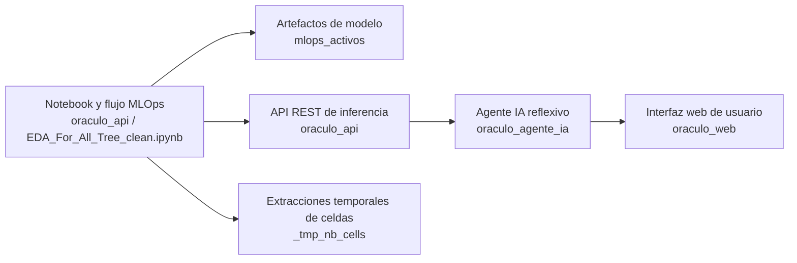

# Proyecto Oráculo

## Qué es este repositorio de trabajo

Esta carpeta raíz reúne todo el ecosistema operativo del proyecto Oráculo. No es solo un backend ni solo un notebook de ciencia de datos: es el espacio donde conviven el entrenamiento analítico, la API REST de inferencia, el agente de IA reflexivo, la web de usuario final y los artefactos temporales que se generan al endurecer el notebook y llevarlo a producción.

La idea central del proyecto es la siguiente:

1. Se diseña y valida el pipeline analítico en notebook.
2. Ese trabajo se traduce a un artefacto utilizable en backend.
3. La API REST expone la inferencia del modelo de forma autenticada.
4. El agente de IA consume esa API para resolver predicciones y también responde preguntas documentales mediante RAG.
5. La web conecta al usuario final con ambos servicios sin obligarlo a manipular tokens a mano.

En otras palabras, esta carpeta raíz funciona como un **workspace maestro** donde cada subcarpeta representa una capa distinta del sistema.

## Mapa general del sistema

## Estructura de la carpeta raíz

| Ruta | Rol dentro del proyecto |
| --- | --- |
| `oraculo_api/` | Backend principal de inferencia, autenticación, persistencia y endurecimiento del puente notebook -> producción. |
| `oraculo_agente_ia/` | Servicio agentic que conversa, enruta intenciones, consulta RAG y solicita predicciones a `oraculo_api`. |
| `oraculo_web/` | Frontend/backend liviano en FastAPI que da una experiencia web unificada al usuario final. |
| `mlops_activos/` | Carpeta de artefactos generados, especialmente modelos serializados y activos de despliegue. |
| `_tmp_nb_cells/` | Espacio técnico de trabajo para extraer, probar y resincronizar celdas complejas del notebook. |
| `cell_focus_plan.txt` | Archivo auxiliar de planeación local para trabajo quirúrgico sobre celdas o flujos del notebook. |
| `_plan_scan.txt` | Archivo temporal de escaneo o análisis del workspace. |
| `mlops_pipeline_auditoria.log` | Log de auditoría y trazabilidad de ejecuciones MLOps o revisiones del pipeline. |

---

## Descripción exhaustiva de cada carpeta

### `oraculo_api/`

Esta es la carpeta más importante desde el punto de vista de producción del modelo. Aquí vive la API REST que toma el trabajo del notebook y lo convierte en un servicio HTTP usable por otras capas del sistema.

No es simplemente un “wrapper” alrededor de un `.pkl`. Su responsabilidad es mucho más amplia:

- exponer endpoints autenticados de predicción;
- gestionar usuarios, login y JWT;
- persistir historial de inferencias;
- cargar artefactos del modelo;
- servir de frontera estable entre el notebook y cualquier consumidor externo;
- proteger el acceso a la lógica del modelo con validaciones, seguridad y contratos HTTP claros.

#### Qué contiene esta carpeta en alto nivel

| Ruta interna | Qué hace |
| --- | --- |
| `app/` | Código fuente del backend FastAPI. |
| `alembic/` | Migraciones versionadas de base de datos. |
| `tests/` | Suite de pruebas del backend HTTP, seguridad, dominios y modelo. |
| `mlops_activos/` | Artefactos exportados para despliegue desde el backend o notebook. |
| `.venv/` | Entorno virtual local del proyecto API. |
| `.git/` | Repositorio Git propio de esta subaplicación. |

#### Qué hace `oraculo_api/app/`

La carpeta `app/` concentra la aplicación real. Está separada por capas, lo cual es importante porque evita mezclar HTTP, seguridad, persistencia y lógica de modelo.

| Subcarpeta | Función |
| --- | --- |
| `app/api/` | Routers FastAPI, endpoints versionados, dependencias HTTP y composición del contrato REST. |
| `app/core/` | Configuración, seguridad, middlewares, manejo de errores, logging y decisiones transversales. |
| `app/db/` | Modelos ORM, sesión, base de datos y repositorios persistentes. |
| `app/ml/` | Carga del artefacto, integración con el pipeline y clases auxiliares para inferencia. |
| `app/schemas/` | DTOs, modelos Pydantic y contratos de entrada/salida. |
| `app/services/` | Reglas de negocio que orquestan operaciones por encima de la capa HTTP. |

#### Archivos importantes de `oraculo_api/`

| Archivo | Función |
| --- | --- |
| `EDA_For_All_Tree_clean.ipynb` | Notebook maestro del pipeline MLOps, análisis, entrenamiento, calibración, fairness y exportación. |
| `adult.csv` | Dataset clásico de Adult Census Income usado como flujo binario principal. |
| `compas-scores-raw.csv` | Dataset usado para validar escenarios multiclase, especialmente con `ScoreText`. |
| `oraculo.db` | Base de datos SQLite local del backend. |
| `Dockerfile` | Contenerización del backend API. |
| `requirements.txt` | Dependencias Python necesarias para levantar la API y su entorno de pruebas. |
| `README.md` | Documentación específica de la API, endpoints y seguridad. |
| `.env` / `.env.example` | Configuración local y plantilla de variables de entorno. |
| `alembic.ini` | Configuración base de Alembic. |

#### Rol operativo de `oraculo_api/` dentro del ecosistema

Cuando el proyecto corre completo, esta carpeta ocupa el papel de **fuente de verdad** para la inferencia estructurada. Todo lo que sea:

- autenticación de usuario;
- emisión de tokens;
- validación del payload de Adult Income;
- cálculo de predicciones;
- trazabilidad de solicitudes;
- persistencia del historial;

pasa por aquí.

El agente y la web no reemplazan esta carpeta: la usan.

---

### `oraculo_agente_ia/`

Esta carpeta contiene el backend del agente IA reflexivo. Aquí no vive el modelo tabular de Adult Income; aquí vive la lógica conversacional y agentic que interpreta lo que el usuario quiere hacer.

Su trabajo principal es decidir entre varios caminos:

- si el usuario quiere una predicción;
- si el usuario está haciendo una consulta documental;
- si mezcla ambos casos;
- si faltan datos;
- si la petición es insegura o no tiene evidencia suficiente.

Esta carpeta funciona como una **capa de inteligencia y orquestación** encima de `oraculo_api`.

#### Qué contiene esta carpeta en alto nivel

| Ruta interna | Qué hace |
| --- | --- |
| `app/` | Código del agente, API de chat, orquestación, memoria, RAG e integraciones. |
| `data/` | Estado local del agente, índices, checkpoints y almacenamiento auxiliar. |
| `knowledge_base/` | Corpus curado que alimenta el RAG. |
| `scripts/` | Scripts de mantenimiento, especialmente reindexación del conocimiento. |
| `tests/` | Pruebas unitarias, integración, seguridad, resiliencia y contrato. |
| `.venv/` | Entorno virtual local del agente. |
| `.git/` | Repositorio Git propio de esta subaplicación. |

#### Qué hace `oraculo_agente_ia/app/`

| Subcarpeta | Función |
| --- | --- |
| `app/agent/` | Grafo agentic, router, critic reflexivo, parsing de predicción y tipos internos del workflow. |
| `app/api/` | Endpoints FastAPI del chat, knowledge admin, threads y dependencias de autenticación. |
| `app/clients/` | Clientes HTTP tipados para comunicarse con `oraculo_api` u otros servicios. |
| `app/core/` | Configuración del agente, middlewares, errores, seguridad y settings del entorno. |
| `app/db/` | Persistencia local del agente para hilos, checkpoints y runtime state. |
| `app/integrations/` | Puentes opcionales o integraciones complementarias. |
| `app/memory/` | Memoria a corto y largo plazo, redacción de PII y persistencia semántica. |
| `app/rag/` | Ingesta, chunking, hashing, retrieval y mantenimiento del vector store. |
| `app/schemas/` | Contratos Pydantic de chat, threads, health, knowledge y respuestas. |
| `app/services/` | Coordinación de casos de uso del agente y fachada de negocio. |

#### Archivos importantes de `oraculo_agente_ia/`

| Archivo | Función |
| --- | --- |
| `Dockerfile` | Imagen del agente para despliegue local o en Hugging Face Spaces. |
| `requirements.txt` | Dependencias de LangChain, LangGraph, FastAPI, Qdrant y testing. |
| `pytest.ini` | Configuración de la suite de pruebas del agente. |
| `README.md` | Documentación técnica propia del servicio agentic. |
| `.env` / `.env.example` | Variables del agente, LLM, LangSmith, Qdrant y conexión a la API de inferencia. |

#### Qué papel cumple el agente en la arquitectura

Esta carpeta no reemplaza el backend clásico ni el notebook. Su rol es:

- interpretar lenguaje natural;
- decidir si el usuario está pidiendo una predicción o una explicación;
- recuperar contexto documental con RAG;
- solicitar a `oraculo_api` una predicción real cuando el caso lo requiere;
- responder de forma más humana, explicativa y conversacional.

En resumen, `oraculo_agente_ia/` es la capa que convierte un ecosistema técnico en una experiencia inteligente.

---

### `oraculo_web/`

Esta carpeta contiene la capa web para el usuario final. No es un frontend estático puro ni un backend pesado; es una aplicación FastAPI ligera que resuelve la experiencia de acceso, sesión y chat de forma integrada.

Su función principal es evitar que el usuario tenga que:

- autenticarse manualmente por Swagger;
- copiar `access_token` a mano;
- llamar por separado a la API del modelo y al agente.

#### Qué contiene esta carpeta en alto nivel

| Ruta interna | Qué hace |
| --- | --- |
| `app/` | Aplicación web FastAPI, rutas HTML/JS y lógica gateway. |
| `tests/` | Pruebas del flujo web, login, sesión y proxy de chat. |
| `.venv/`, `.venv_run/`, `.venv_test/` | Entornos de trabajo usados durante desarrollo, ejecución y pruebas. |

#### Qué hace `oraculo_web/app/`

| Subcarpeta / archivo | Función |
| --- | --- |
| `app/static/` | HTML, CSS y JavaScript de la interfaz que consume la web. |
| `app/main.py` | App FastAPI, endpoints, sesión y proxy de autenticación/chat. |
| `app/config.py` | Variables de entorno y configuración de la web. |
| `app/gateway.py` | Cliente/gateway hacia `oraculo_api` y `oraculo_agente_ia`. |
| `app/schemas.py` | Esquemas de entrada/salida de la capa web. |

#### Rol operativo de `oraculo_web/`

`oraculo_web/` une la experiencia humana con los servicios backend. El flujo es:

1. el usuario se registra o hace login;
2. la web llama a `oraculo_api`;
3. la web conserva la sesión;
4. cuando el usuario escribe en el chat, reenvía su bearer al agente;
5. el agente decide si debe consultar la API del modelo o el RAG.

Es, en la práctica, la **puerta de entrada amigable** del proyecto.

---

### `mlops_activos/`

Esta carpeta raíz almacena artefactos serializados y salidas de producción o preproducción, especialmente cuando el notebook o las fases de ensamblaje exportan modelos.

En este workspace hoy contiene:

| Archivo | Función |
| --- | --- |
| `oraculo_lightgbm.pkl` | Artefacto serializado de modelo usado como salida del flujo MLOps. |

#### Qué representa esta carpeta

No es código fuente. Es una carpeta de **resultado**. Normalmente aquí viven:

- modelos entrenados;
- pipelines exportados;
- manifiestos de modelo;
- activos listos para despliegue;
- salidas reproducibles del pipeline.

Por esa razón, en un `.gitignore` raíz suele tratarse como carpeta generada o al menos como carpeta que debe controlarse cuidadosamente.

---

### `_tmp_nb_cells/`

Esta carpeta es técnica y muy importante durante el trabajo de endurecimiento del notebook. Su objetivo no es producción final sino facilitar cirugía fina sobre `EDA_For_All_Tree_clean.ipynb`.

Cuando el notebook es muy grande, editarlo directamente como JSON es incómodo y frágil. Esta carpeta resuelve eso extrayendo celdas a archivos `.py` independientes para poder:

- leerlas más cómodamente;
- probarlas aisladas;
- hacer parches más seguros;
- resincronizarlas luego al notebook principal.

#### Qué contiene

| Tipo de archivo | Función |
| --- | --- |
| `cell_106.py`, `cell_123.py`, `cell_130.py`, etc. | Extracciones de celdas concretas del notebook para edición y validación aislada. |
| `validation_*.json` | Resultados de validaciones, smoke tests o comparativas de corridas. |
| `__pycache__/` | Caché Python local. |

#### Por qué existe esta carpeta

Su valor principal es operativo:

- reduce el riesgo de romper un notebook monolítico;
- permite comparar versiones de una celda compleja;
- da trazabilidad de validaciones rápidas sobre flujos como 18.3, 19.x o 20.1;
- desacopla el trabajo de depuración del archivo `.ipynb` crudo.

No es una carpeta pensada para despliegue. Es una **zona de trabajo técnico**.

---

## Descripción de los archivos raíz no agrupados en carpeta

### `cell_focus_plan.txt`

Archivo auxiliar de planeación. Normalmente se usa para dejar por escrito en qué celdas o fases del notebook conviene concentrar el trabajo, qué dependencias arrastran y qué problemas se están atacando.

### `_plan_scan.txt`

Archivo auxiliar de análisis o escaneo del workspace. Suele servir como apoyo temporal cuando se está revisando una estructura grande y se necesita conservar un mapa intermedio del trabajo.

### `mlops_pipeline_auditoria.log`

Log de auditoría del pipeline. Es útil para:

- reconstruir qué pasó en una corrida;
- inspeccionar tiempos o decisiones;
- revisar eventos de entrenamiento, calibración o ensamblaje;
- comparar salidas cuando se corrigen celdas del notebook.

---

## Cómo se relacionan entre sí las carpetas

La forma más fácil de entender este workspace es verlo como una cadena de capas:

### 1. Capa analítica y de entrenamiento

Aquí vive el notebook y su endurecimiento:

- `oraculo_api/EDA_For_All_Tree_clean.ipynb`
- `_tmp_nb_cells/`
- `mlops_activos/`

Esta capa define cómo se limpia, transforma, calibra, evalúa y exporta el modelo.

### 2. Capa de servicio de inferencia

La representa `oraculo_api/`.

Aquí el modelo se vuelve un servicio HTTP autenticado y trazable.

### 3. Capa agentic y conversacional

La representa `oraculo_agente_ia/`.

Aquí la lógica ya no es “solo predecir”, sino interpretar intención, consultar conocimiento y decidir si debe llamar o no al backend de inferencia.

### 4. Capa de experiencia de usuario

La representa `oraculo_web/`.

Aquí la complejidad técnica queda detrás de una interfaz unificada para registro, login y conversación.

---

## Flujo típico de trabajo dentro de esta carpeta raíz

Un flujo realista de desarrollo en este workspace suele verse así:

1. Se ajusta una fase del notebook en `oraculo_api/EDA_For_All_Tree_clean.ipynb`.
2. Si la celda es compleja, se extrae a `_tmp_nb_cells/` para trabajarla con más seguridad.
3. Se validan artefactos y se exporta un modelo a `mlops_activos/`.
4. `oraculo_api/` consume ese artefacto o su contrato asociado.
5. `oraculo_agente_ia/` se integra con la API para resolver predicciones desde lenguaje natural.
6. `oraculo_web/` expone todo al usuario final en una sola experiencia.

---

## Qué sí es código fuente y qué no

### Código fuente principal

- `oraculo_api/app/`
- `oraculo_agente_ia/app/`
- `oraculo_web/app/`

### Activos de entrenamiento o soporte analítico

- `oraculo_api/EDA_For_All_Tree_clean.ipynb`
- `oraculo_api/adult.csv`
- `oraculo_api/compas-scores-raw.csv`

### Salidas generadas o temporales

- `mlops_activos/`
- `_tmp_nb_cells/validation_*.json`
- `mlops_pipeline_auditoria.log`
- bases SQLite locales
- entornos virtuales

---

## Recomendación de lectura para orientarse rápido

Si una persona nueva entra a esta carpeta, el mejor orden para entender el proyecto es:

1. `oraculo_api/README.md`
2. `oraculo_agente_ia/README.md`
3. `oraculo_web/README.md`
4. luego volver a este `README.md` para ver la relación global entre módulos

Si el foco es puramente analítico o MLOps, entonces el orden recomendado cambia:

1. `oraculo_api/EDA_For_All_Tree_clean.ipynb`
2. `_tmp_nb_cells/`
3. `mlops_activos/`

---

## Qué problema resuelve esta organización

La carpeta `Proyecto/` evita tener un sistema fragmentado en piezas sueltas sin conexión. En lugar de tener:

- un notebook aislado;
- una API separada;
- un agente por otro lado;
- una web desconectada;

todo queda reunido y trazable en un solo workspace maestro.

Eso permite:

- evolucionar el notebook sin perder la vista del backend;
- endurecer el backend sin olvidar el agente;
- mejorar el agente sin romper la experiencia web;
- documentar el sistema completo desde una sola raíz.

## Resumen operativo final

Aunque cada carpeta tiene identidad propia, juntas forman una sola plataforma:

- `oraculo_api/` es la capa de inferencia estructurada y autenticada.
- `oraculo_agente_ia/` es la capa de inteligencia conversacional y RAG.
- `oraculo_web/` es la capa de acceso para el usuario final.
- `mlops_activos/` concentra salidas serializadas del pipeline.
- `_tmp_nb_cells/` sirve como espacio de cirugía técnica del notebook.

Esta carpeta raíz existe para que esas piezas no vivan desconectadas, sino coordinadas dentro de un mismo ecosistema de desarrollo, validación y despliegue.
