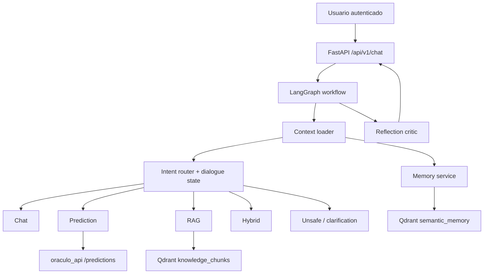

# Oraculo Agente IA

Backend agentic en `FastAPI` para el ecosistema Oráculo. Esta versión ya no se comporta como un router rígido con respuestas prediseñadas: usa un **chat model real** como cerebro conversacional, conserva routing especializado para `prediction`, `rag`, `hybrid` y `unsafe`, y mantiene memoria operativa por `thread`.

## Qué hace hoy

- conversa de forma natural con la ruta `chat`
- guía predicciones del dataset Adult Income **paso a paso**
- usa `RAG` sobre chunks indexados en Qdrant
- conserva memoria corta del thread y memoria larga semántica
- llama a `oraculo_api` para la inferencia real
- aplica guardrails de seguridad y reflexión final antes de responder

## Stack principal

- `LangGraph`: orquestación stateful del workflow
- `LangChain`: modelos, mensajes, structured output y retrieval
- `Google Gemini`: proveedor primario de chat/embeddings
- `OpenAI`: fallback opcional para chat/embeddings
- `Qdrant`: vector store de conocimiento y memoria
- `SQLite`: threads, mensajes, memorias, fuentes y checkpoints
- `LangMem`: extracción opcional de memorias útiles
- `LangServe`: rutas debug/playground opcionales

## Flujo de alto nivel



## Rutas del agente

- `chat`: saludo, onboarding, ayuda general y continuidad conversacional
- `prediction`: recolección de slots + predicción real contra `oraculo_api`
- `rag`: respuesta documental con citas obligatorias
- `hybrid`: predicción + contexto documental en una sola respuesta
- `unsafe`: rechazo seguro de requests maliciosos
- `clarification`: estado interno para desambiguación fina

## Memoria y contexto

El agente usa dos niveles de memoria:

- **memoria corta**:
  - historial reciente del thread
  - `conversation_state` persistido en `metadata_json` del mensaje del asistente
  - slots de predicción ya capturados
- **memoria larga**:
  - recuerdos semánticos por usuario
  - persistidos en SQLite + Qdrant
  - extraídos por heurísticas y, si el LLM está disponible, con `LangMem`

Esto permite que un usuario diga:

1. `Quiero una predicción`
2. `Tengo 39 años`
3. `Trabajo 40 horas por semana`

y el agente recuerde los datos anteriores sin pedirlos de nuevo.

## RAG y chunks

El conocimiento externo se construye así:

1. se cargan documentos del directorio `knowledge_base/`
2. se generan fuentes auxiliares en `data/generated/`
3. se parte el contenido con `RecursiveCharacterTextSplitter`
4. se indexan los chunks en Qdrant
5. el agente reescribe la consulta cuando conviene
6. recupera hits y compone la respuesta usando solo la evidencia disponible

Si la base documental no respalda la respuesta, el agente lo dice explícitamente.

## Cerebro del agente

El gateway del modelo selecciona proveedor así:

1. `Google Gemini` si hay `ORACULO_AGENT_GOOGLE_API_KEY`
2. `OpenAI` si hay `ORACULO_AGENT_OPENAI_API_KEY`
3. fallback sin LLM solo para desarrollo offline

Cuando no hay cerebro conectado, el agente lo reconoce con una respuesta explícita del estilo:

`Conecta el cerebro: necesito una API del LLM válida...`

## Endpoints

### Salud

- `GET /`
- `GET /api/v1/health/live`
- `GET /api/v1/health/ready`

### Chat

- `POST /api/v1/chat/invoke`
- `POST /api/v1/chat/stream`

### Threads

- `GET /api/v1/threads/{thread_id}`

### Knowledge admin

- `GET /api/v1/knowledge/sources`
- `POST /api/v1/knowledge/reindex`

## Variables de entorno importantes

- `ORACULO_AGENT_GOOGLE_API_KEY`
- `ORACULO_AGENT_GOOGLE_CHAT_MODEL`
- `ORACULO_AGENT_GOOGLE_EMBEDDING_MODEL`
- `ORACULO_AGENT_OPENAI_API_KEY`
- `ORACULO_AGENT_OPENAI_CHAT_MODEL`
- `ORACULO_AGENT_OPENAI_EMBEDDING_MODEL`
- `ORACULO_AGENT_ASSISTANT_NAME`
- `ORACULO_AGENT_CHAT_HISTORY_WINDOW`
- `ORACULO_AGENT_PREDICTION_FIELDS_PER_TURN`
- `ORACULO_AGENT_ORACULO_API_BASE_URL`
- `ORACULO_AGENT_ORACULO_API_SERVICE_EMAIL`
- `ORACULO_AGENT_ORACULO_API_SERVICE_PASSWORD`
- `ORACULO_AGENT_ADMIN_API_KEY`

Toma como base `.env.example`.

## Ejecución local

```powershell
python -m venv .venv
.venv\Scripts\activate
pip install -r requirements.txt
copy .env.example .env
uvicorn app.main:app --reload
```

Swagger:

- `http://127.0.0.1:8000/docs`

## Ejemplos de uso

### Conversación

`Hola`

### Predicción progresiva

1. `Quiero una predicción de ingresos`
2. `Tengo 39 años`
3. `Mi tipo de trabajo es Private`

### Predicción completa

`Haz una predicción con este JSON: {...}`

### RAG

`¿Qué endpoint usa el agente para chat sin streaming?`

### Hybrid

`Haz una predicción con este JSON y explícame qué endpoint usa el agente`

## Testing

La suite valida:

- conversación natural por ruta `chat`
- continuidad del flujo de predicción entre turnos
- extracción de campos desde JSON, `clave: valor` y lenguaje natural
- memoria y redacción de PII
- retrieval y reindex incremental/full
- seguridad, rate limiting y headers
- streaming SSE con eventos `accepted`, `route`, `slot_requested`, `tool_completed` y `final`

Ejecución:

```powershell
.venv\Scripts\python -m pytest -q
```

Estado validado en esta iteración:

- `38 passed`

## Smoke test real del cerebro

Con la API de Google presente en `.env`, el smoke test local devolvió:

- proveedor activo: `google`
- respuesta natural a `Hola`
- confianza: `0.85`

## Seguridad

- JWT para endpoints de chat y threads
- validación remota opcional del usuario en `oraculo_api`
- `X-Agent-Admin-Key` para endpoints admin
- guardrails ante prompt injection y bypass
- CSP, `TrustedHostMiddleware`, CORS y rate limit
- sin shell ni filesystem arbitrario expuesto al usuario

## Notas de producción

- Qdrant local sirve para single-instance; para escalar conviene servidor dedicado
- SQLite es suficiente para entorno ligero y desarrollo
- el diseño actual deja abierta una migración futura a Postgres + Redis + LangSmith más profundo
- si quieres más calidad conversacional, el mayor salto no está en más templates sino en mejor provider/modelo y mejores fuentes documentales
