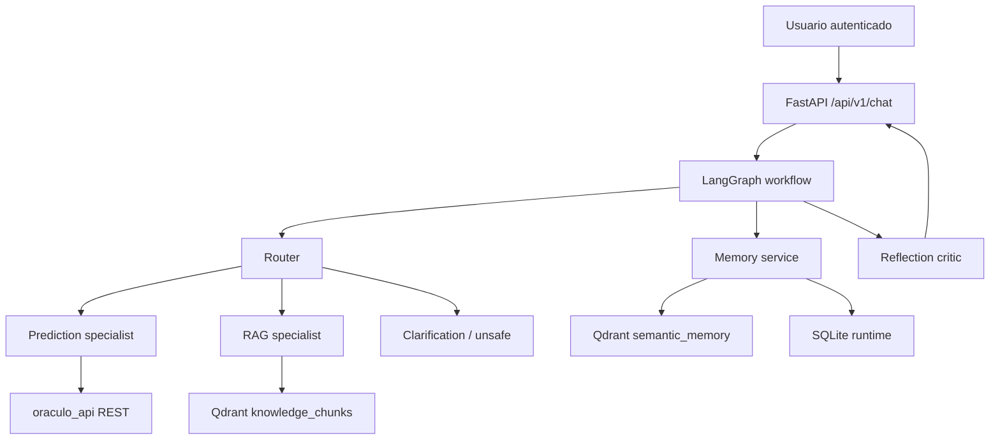

# Oraculo Agente IA

Servicio agentic en `FastAPI` para conversar con usuarios, resolver dudas documentales con `RAG`, y solicitar predicciones reales a `oraculo_api` cuando el usuario entrega los campos del dataset Adult Income.

El proyecto esta construido para crecer como backend profesional:

- `LangGraph` para la orquestacion stateful del agente.
- `LangChain` para modelos, embeddings, retrieval y structured outputs.
- `Google Gemini` como proveedor LLM por defecto.
- `Qdrant` local persistente como vector store para conocimiento y memoria semantica.
- `SQLite` para threads, mensajes, knowledge sources, memorias y checkpoints locales.
- `LangServe` opcional para rutas debug/playground de router y RAG.
- `LangMem` como capa opcional de extraccion de memoria a largo plazo.

## Objetivo

El flujo principal es:

1. El usuario envia una peticion autenticada al agente.
2. El router decide si la intencion es `prediction`, `rag`, `hybrid`, `clarification` o `unsafe`.
3. Si faltan campos para inferencia, el agente pide aclaraciones y no inventa variables.
4. Si la necesidad es documental, hace retrieval sobre el corpus indexado y exige citas.
5. Si la necesidad es de prediccion, llama a `oraculo_api` con una cuenta tecnica y mantiene el contrato REST existente.
6. Un critic de reflexion revisa evidencia, seguridad, coherencia y degradacion segura antes de responder.

## Arquitectura



### Componentes principales

- `app/main.py`: app factory, lifespan, servicios compartidos, middlewares y montaje opcional de LangServe.
- `app/agent/`: tipos, router, contrato de prediccion, model gateway, critic de reflexion y grafo de LangGraph.
- `app/clients/oraculo_api.py`: cliente HTTP tipado con retry, timeout y refresh de token tecnico.
- `app/rag/service.py`: ingesta, hashing, reindex incremental/full, retrieval y snapshot de fuentes.
- `app/memory/service.py`: extraccion heuristica/LangMem, redaccion de PII y memoria semantica.
- `app/services/`: coordinacion de chat, health, knowledge admin y threads.
- `app/db/`: modelos, repositorios y session factory SQLAlchemy.
- `knowledge_base/`: corpus curado del agente.
- `scripts/reindex_knowledge.py`: reindex manual del corpus.

## Funcionalidades incluidas

- Chat `invoke` y `stream` con trazabilidad por `thread_id`.
- Orquestacion stateful con checkpoints SQLite de LangGraph.
- RAG con citas obligatorias y degradacion a "no tengo respaldo suficiente".
- Integracion real con `oraculo_api` via `/api/v1/auth/login`, `/api/v1/auth/me` y `/api/v1/predictions`.
- Memoria corta por thread y memoria larga semantica por usuario.
- Guardrails para prompt injection, requests inseguras y claims sin evidencia.
- Health checks `live` y `ready`.
- Endpoints admin para reindex y listado de fuentes.
- Rutas LangServe opcionales para debug:
  - `/debug/langserve/router`
  - `/debug/langserve/rag`

## Endpoints

### Salud

- `GET /`
- `GET /api/v1/health/live`
- `GET /api/v1/health/ready`

### Chat

- `POST /api/v1/chat/invoke`
- `POST /api/v1/chat/stream`

### Threads

- `GET /api/v1/threads/{thread_id}`

### Knowledge admin

- `POST /api/v1/knowledge/reindex`
- `GET /api/v1/knowledge/sources`

## Seguridad

El servicio aplica seguridad defensiva en varias capas:

- JWT para endpoints de chat y threads.
- `X-Agent-Admin-Key` para reindex y fuentes.
- `TrustedHostMiddleware` y CORS configurables por entorno.
- rate limiting in-memory por IP.
- limite maximo de payload.
- headers de seguridad (`CSP`, `X-Frame-Options`, `nosniff`, `Cache-Control`, etc.).
- redaccion basica de PII antes de persistir memoria semantica.
- allowlist de tools: solo retrieval, memoria y llamadas tipadas a `oraculo_api`.
- rechazo explicito a prompt injection, exfiltracion y bypass de politicas.

## Modelo y proveedor LLM

- Chat/reflexion: `gemini-2.5-flash`
- Embeddings: `models/gemini-embedding-001`

Si no configuras `GOOGLE_API_KEY`, el sistema usa embeddings hash deterministas para no bloquear desarrollo local ni la suite de tests. Esto permite ejecutar RAG y memoria de forma offline, aunque con menos calidad semantica que Gemini.

## Variables de entorno

El archivo base es `.env.example`. Las mas importantes son:

- `ORACULO_AGENT_GOOGLE_API_KEY`
- `ORACULO_AGENT_ORACULO_API_BASE_URL`
- `ORACULO_AGENT_ORACULO_API_JWT_SECRET_KEY`
- `ORACULO_AGENT_ORACULO_API_SERVICE_EMAIL`
- `ORACULO_AGENT_ORACULO_API_SERVICE_PASSWORD`
- `ORACULO_AGENT_ADMIN_API_KEY`
- `ORACULO_AGENT_ALLOWED_HOSTS`
- `ORACULO_AGENT_CORS_ALLOW_ORIGINS`
- `ORACULO_AGENT_QDRANT_PATH`
- `ORACULO_AGENT_CHECKPOINTS_DB_PATH`
- `ORACULO_AGENT_DATABASE_URL`
- `ORACULO_AGENT_ENABLE_LANGSERVE`

## Ejecucion local

```powershell
python -m venv .venv
.venv\Scripts\activate
pip install -r requirements.txt
copy .env.example .env
```

Ajusta `.env` con:

- la URL real de `oraculo_api`
- el mismo `JWT_SECRET_KEY` que usa `oraculo_api`
- credenciales de la cuenta tecnica
- tu `GOOGLE_API_KEY` si quieres usar Gemini real

Luego puedes arrancar:

```powershell
uvicorn app.main:app --reload
```

Documentacion:

- `http://127.0.0.1:8000/docs`

## Reindex del conocimiento

```powershell
.venv\Scripts\python scripts\reindex_knowledge.py
```

El reindex indexa:

- `knowledge_base/*.md`
- fuentes generadas en `data/generated/`
- `oraculo_api/README.md`
- snapshot del `openapi` si la API esta disponible

## Testing

La suite cubre:

- parsing y validacion de `PredictionInput`
- router heuristico y critic de reflexion
- settings y normalizacion de hosts/origins
- cliente HTTP de `oraculo_api`
- memoria con redaccion de PII
- reindex incremental/full y retrieval sobre Qdrant
- endpoints FastAPI de chat, health, admin, threads y streaming SSE
- contrato OpenAPI con Schemathesis
- integracion viva `agente -> oraculo_api`

Ejecutar toda la suite:

```powershell
.venv\Scripts\pytest -q
```

Estado validado durante esta implementacion:

- `30 passed`

## Observabilidad y evaluacion

- Tracing local estructurado por logger y `request_id`.
- `LangSmith` opcional por variables de entorno.
- `trace_id` devuelto en cada respuesta de chat.
- `thread_id` persistente para reproducibilidad de conversaciones.

## Notas de produccion

- `Qdrant` local funciona bien para un despliegue single-service; si necesitas concurrencia multi-instancia, pasa a un servidor Qdrant dedicado.
- `SQLite` sirve para desarrollo y despliegue ligero; la capa de persistencia esta separada para migrar luego a Postgres.
- El agente no ejecuta shell, SQL libre ni filesystem arbitrario.
- Para produccion de LangChain/LangGraph, hoy es mas conservador usar Python 3.12 o 3.13; con Python 3.14 la app funciona, pero algunas dependencias aun muestran warnings upstream.

## Troubleshooting

### `401 authentication_error`

- Verifica que el JWT del usuario este firmado con la misma secret que `oraculo_api`.
- Revisa `ORACULO_AGENT_ORACULO_API_VERIFY_REMOTE_USER`.

### `502 upstream_service_error`

- Revisa `ORACULO_AGENT_ORACULO_API_BASE_URL`.
- Valida la cuenta tecnica y el contrato real de `/api/v1/predictions`.

### `ready = degraded`

Es normal si falta alguna dependencia no critica, por ejemplo:

- no hay `GOOGLE_API_KEY`
- `oraculo_api` esta caida
- aun no has indexado conocimiento

### Qdrant bloqueado por otra instancia

Si compartes carpeta local de Qdrant entre procesos distintos, el lock fallara. Para desarrollo concurrente usa rutas separadas o un Qdrant server externo.

## Roadmap sugerido

- Postgres para estado y checkpoints en multi-entorno.
- Redis para rate limiting distribuido.
- evaluaciones de LangSmith con datasets versionados.
- aprobaciones humanas para tools sensibles.
- dashboards de trazas, costos y calidad de retrieval.
