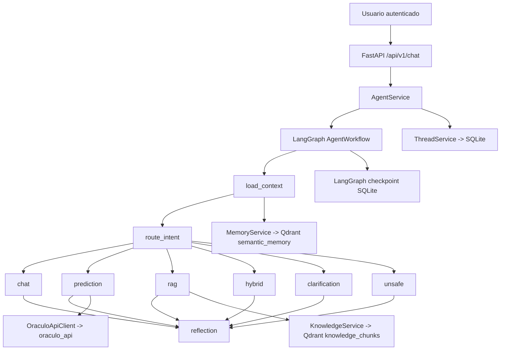

<div align="center">

# 🤖 Oraculo Agente IA

### Backend agentic conversacional para predicción, RAG, memoria semántica y orquestación con LangGraph


</div>

---

## 📌 Qué es este servicio

`oraculo_agente_ia` es el backend conversacional del ecosistema **Oráculo**.  
No es solo un chatbot, ni solo una capa de RAG, ni solo un proxy a `oraculo_api`: es el servicio que **interpreta la intención del usuario, decide qué ruta seguir, conserva estado conversacional, usa memoria, consulta conocimiento documental y, cuando corresponde, llama a la API de predicción real**.

En términos prácticos, este módulo permite que un usuario escriba algo como:

- “Hola”
- “Quiero una predicción”
- “Tengo 39 años y trabajo 50 horas por semana”
- “¿Qué endpoint usa el agente para chat?”
- “Haz una predicción y explícame la arquitectura”

y el sistema responda de forma distinta según el caso:

- conversación natural,
- recolección progresiva de slots de predicción,
- consulta documental con evidencia,
- mezcla de predicción + contexto documental,
- aclaración de intención,
- rechazo seguro de solicitudes inseguras.

---

## 🎯 Objetivo principal

Este servicio resuelve varios problemas a la vez:

1. **Dar una experiencia conversacional real** sobre el proyecto Oráculo.
2. **Transformar lenguaje natural en una predicción estructurada** del dataset Adult Income.
3. **Responder preguntas documentales con recuperación semántica (RAG)**.
4. **Persistir hilos, mensajes y memoria útil** entre turnos.
5. **Integrarse con `oraculo_api`** para obtener la predicción oficial del modelo.
6. **Añadir guardrails, reflexión y trazabilidad** antes de devolver una respuesta final.

---

## 🧠 Qué hace exactamente

### Conversación

El agente puede mantener una conversación normal y responder saludos, preguntas generales, continuidad social y dudas sobre sus capacidades.

### Predicción guiada

Si el usuario quiere una predicción de ingresos, el agente:

- detecta la intención,
- intenta extraer campos del mensaje,
- recuerda slots ya capturados en el hilo,
- pide solo los datos faltantes,
- valida el contrato del payload,
- llama a `oraculo_api`,
- devuelve el resultado explicado en lenguaje natural.

### RAG documental

Si el usuario hace una pregunta sobre el proyecto, el agente:

- reescribe la consulta para retrieval,
- busca chunks en Qdrant,
- construye una respuesta con evidencia,
- incluye citas y snippets de respaldo.

### Hybrid

Si la solicitud mezcla predicción + conocimiento documental, el flujo combina ambos resultados en una sola respuesta.

### Clarification

Cuando la intención no está clara, el agente no inventa. En su lugar, pide precisión y ofrece caminos concretos.

### Unsafe

Si detecta manipulación del sistema, intentos de bypass, exfiltración o prompt injection, responde con rechazo seguro.

### Reflection

Antes de terminar, una capa crítica revisa la respuesta para confirmar que:

- la ruta activa fue respetada,
- no faltan citas si era RAG,
- no se cerró una predicción sin resultado real,
- no se respondió de forma rígida o inútil,
- la respuesta final sea mejor que un borrador genérico.

---

## 🏗️ Arquitectura de alto nivel



---

## 🧩 Componentes principales

| Componente         | Rol                                                                          |
| ------------------ | ---------------------------------------------------------------------------- |
| `FastAPI`          | Expone los endpoints HTTP del agente.                                        |
| `LangGraph`        | Orquesta el workflow stateful del agente.                                    |
| `ModelGateway`     | Gestiona proveedor LLM, embeddings, prompts y structured outputs.            |
| `KnowledgeService` | Ingesta, chunking, reindexado y retrieval documental en Qdrant.              |
| `MemoryService`    | Guarda memoria semántica útil por usuario e hilo.                            |
| `ThreadService`    | Persiste la conversación y reconstruye el contexto.                          |
| `OraculoApiClient` | Valida tokens de usuario y ejecuta predicciones reales contra `oraculo_api`. |
| `ReflectionCritic` | Revisa la calidad y seguridad de la respuesta antes de devolverla.           |

---

## 📁 Estructura del módulo

```text
oraculo_agente_ia/
├── app/
│   ├── agent/
│   │   ├── dialogue.py
│   │   ├── graph.py
│   │   ├── model_gateway.py
│   │   ├── prediction_contract.py
│   │   ├── reflection.py
│   │   ├── routing.py
│   │   └── types.py
│   ├── api/
│   │   ├── dependencies.py
│   │   ├── router.py
│   │   └── v1/
│   │       ├── router.py
│   │       └── endpoints/
│   │           ├── chat.py
│   │           ├── health.py
│   │           ├── knowledge.py
│   │           └── threads.py
│   ├── clients/
│   │   └── oraculo_api.py
│   ├── core/
│   │   ├── config.py
│   │   ├── error_handlers.py
│   │   ├── exceptions.py
│   │   ├── logging.py
│   │   └── middleware.py
│   ├── db/
│   │   ├── base.py
│   │   ├── session.py
│   │   ├── models/
│   │   └── repositories/
│   ├── integrations/
│   │   └── langserve.py
│   ├── memory/
│   │   └── service.py
│   ├── rag/
│   │   └── service.py
│   ├── schemas/
│   │   ├── chat.py
│   │   ├── common.py
│   │   ├── health.py
│   │   ├── knowledge.py
│   │   └── thread.py
│   ├── services/
│   │   ├── agent.py
│   │   ├── health.py
│   │   ├── knowledge.py
│   │   └── thread.py
│   └── main.py
├── knowledge_base/
├── scripts/
│   └── reindex_knowledge.py
├── tests/
├── .env.example
├── .dockerignore
├── Dockerfile
├── README.md
└── requirements.txt
```

---

# ⚙️ Stack técnico real

## Runtime / API

- `fastapi`
- `uvicorn`
- `httptools`
- `watchfiles`
- `websockets`
- `sse-starlette`
- `python-multipart`

### Qué aportan

- **FastAPI** expone la API del agente.
- **Uvicorn** corre el servidor ASGI.
- **SSE Starlette** soporta streaming por eventos para `/chat/stream`.
- **python-multipart** permite la carga de documentos por `/knowledge/upload`.

---

## Configuración / seguridad

- `pydantic`
- `pydantic-settings`
- `python-dotenv`
- `PyJWT`
- `httpx`

### Qué aportan

- **Pydantic** valida contratos de entrada/salida.
- **pydantic-settings** centraliza la configuración por variables de entorno.
- **python-dotenv** permite cargar `.env` en local.
- **PyJWT** valida el token del usuario cuando no se hace validación remota.
- **httpx** se usa para comunicarse con `oraculo_api` y para obtener el snapshot remoto de OpenAPI.

---

## Persistencia / almacenamiento

- `SQLAlchemy`
- `aiosqlite`
- `qdrant-client`
- `pypdf`

### Qué aportan

- **SQLite + SQLAlchemy** guardan hilos, mensajes, memorias y fuentes indexadas.
- **Qdrant** guarda embeddings para `knowledge_chunks` y `semantic_memory`.
- **pypdf** permite extraer texto de PDFs para la base de conocimiento.

---

## Ecosistema agentic

- `langchain`
- `langgraph`
- `langgraph-checkpoint-sqlite`
- `langchain-google-genai`
- `langchain-openai`
- `langchain-qdrant`
- `langchain-text-splitters`
- `langserve`
- `langmem`
- `langsmith`

### Qué aportan

- **LangGraph** construye el grafo del agente.
- **LangChain** aporta documentos, mensajes, structured outputs y abstracciones LLM.
- **langgraph-checkpoint-sqlite** guarda checkpoints del workflow.
- **langchain-google-genai** integra Gemini.
- **langchain-openai** integra OpenAI o endpoints compatibles.
- **langchain-qdrant** conecta retrieval y memoria con Qdrant.
- **langchain-text-splitters** parte documentos en chunks.
- **LangServe** monta rutas de depuración opcionales.
- **LangMem** intenta extraer recuerdos persistentes del usuario.
- **LangSmith** queda preparado para tracing.

---

## Testing / calidad

- `pytest`
- `pytest-asyncio`
- `hypothesis`
- `schemathesis`

### Qué aportan

- **Pytest** para pruebas funcionales.
- **pytest-asyncio** para escenarios async.
- **Hypothesis** para validación generativa.
- **Schemathesis** para pruebas basadas en contrato OpenAPI.

---

# 🚀 Instalación completa

## 1) Requisitos previos

- Python **3.11 o superior**
- `pip`
- acceso a una API LLM válida si quieres experiencia conversacional completa:
  - Google Gemini, o
  - OpenAI / endpoint compatible
- acceso a `oraculo_api` si quieres predicción real
- Git opcional para clonar el repositorio

---

## 2) Crear entorno virtual

### Windows PowerShell

```powershell
python -m venv .venv
.venv\Scripts\Activate.ps1
```

### Windows CMD

```bat
python -m venv .venv
.venv\Scripts\activate
```

### Linux / macOS

```bash
python -m venv .venv
source .venv/bin/activate
```

---

## 3) Instalar dependencias

```bash
pip install --upgrade pip
pip install -r requirements.txt
```

### Qué instala exactamente `requirements.txt`

#### API / Runtime

```txt
fastapi
uvicorn
httptools
watchfiles
websockets
sse-starlette
python-multipart
```

#### Configuration / Security

```txt
pydantic
pydantic-settings
python-dotenv
PyJWT
httpx
```

#### Database / Storage

```txt
SQLAlchemy
aiosqlite
qdrant-client
pypdf
```

#### LangChain Ecosystem

```txt
langchain
langgraph
langgraph-checkpoint-sqlite
langchain-google-genai
langchain-openai
langchain-qdrant
langchain-text-splitters
langserve
langmem
langsmith
```

#### Testing / Quality

```txt
pytest
pytest-asyncio
hypothesis
schemathesis
```

---

## 4) Crear archivo `.env`

Usa `.env.example` como base:

```bash
cp .env.example .env
```

En Windows:

```powershell
copy .env.example .env
```

---

## 5) Configurar variables críticas

Debes revisar como mínimo:

- proveedor LLM,
- conexión a `oraculo_api`,
- clave administrativa,
- paths de persistencia,
- CORS / hosts.

---

## 6) Levantar el servidor

```bash
uvicorn app.main:app --reload
```

Por defecto tendrás:

- App root: `http://127.0.0.1:8000/`
- Swagger: `http://127.0.0.1:8000/docs`
- ReDoc: `http://127.0.0.1:8000/redoc`

---

# 🔐 Variables de entorno

## Identidad general

| Variable                    | Descripción                                                        |
| --------------------------- | ------------------------------------------------------------------ |
| `ORACULO_AGENT_APP_NAME`    | Nombre de la aplicación.                                           |
| `ORACULO_AGENT_APP_VERSION` | Versión lógica del agente.                                         |
| `ORACULO_AGENT_ENVIRONMENT` | Entorno (`local`, `development`, `test`, `staging`, `production`). |
| `ORACULO_AGENT_DEBUG`       | Activa logging más verboso.                                        |

---

## Persistencia local

| Variable                                      | Descripción                                          |
| --------------------------------------------- | ---------------------------------------------------- |
| `ORACULO_AGENT_DATABASE_URL`                  | Base SQLite o motor SQL principal del agente.        |
| `ORACULO_AGENT_CHECKPOINTS_DB_PATH`           | Ruta del archivo SQLite de checkpoints de LangGraph. |
| `ORACULO_AGENT_QDRANT_PATH`                   | Ruta local del almacenamiento Qdrant embebido.       |
| `ORACULO_AGENT_QDRANT_COLLECTION_NAME`        | Colección para chunks documentales.                  |
| `ORACULO_AGENT_QDRANT_MEMORY_COLLECTION_NAME` | Colección para memoria semántica.                    |

---

## Proveedor Google

| Variable                               | Descripción                     |
| -------------------------------------- | ------------------------------- |
| `ORACULO_AGENT_GOOGLE_API_KEY`         | API key de Gemini.              |
| `ORACULO_AGENT_GOOGLE_CHAT_MODEL`      | Modelo de chat de Google.       |
| `ORACULO_AGENT_GOOGLE_EMBEDDING_MODEL` | Modelo de embeddings de Google. |
| `ORACULO_AGENT_GOOGLE_TEMPERATURE`     | Temperatura del modelo de chat. |

---

## Proveedor OpenAI / compatible

| Variable                               | Descripción                                  |
| -------------------------------------- | -------------------------------------------- |
| `ORACULO_AGENT_OPENAI_API_KEY`         | API key OpenAI.                              |
| `ORACULO_AGENT_OPENAI_CHAT_MODEL`      | Modelo de chat OpenAI.                       |
| `ORACULO_AGENT_OPENAI_EMBEDDING_MODEL` | Modelo de embeddings OpenAI.                 |
| `ORACULO_AGENT_OPENAI_TEMPERATURE`     | Temperatura del modelo.                      |
| `ORACULO_AGENT_OPENAI_BASE_URL`        | Base URL opcional para proveedor compatible. |

---

## Alias ChatGPT / compatible

El `Settings` del proyecto también admite estas variables como alias/fallback:

| Variable                                | Descripción                                 |
| --------------------------------------- | ------------------------------------------- |
| `ORACULO_AGENT_CHATGPT_API_KEY`         | Alias alternativo de API key.               |
| `ORACULO_AGENT_CHATGPT_BASE_URL`        | Alias alternativo de base URL.              |
| `ORACULO_AGENT_CHATGPT_CHAT_MODEL`      | Alias alternativo del modelo de chat.       |
| `ORACULO_AGENT_CHATGPT_EMBEDDING_MODEL` | Alias alternativo del modelo de embeddings. |
| `ORACULO_AGENT_CHATGPT_TEMPERATURE`     | Alias alternativo de temperatura.           |

> El código toma `openai_*` o `chatgpt_*`, según cuál esté presente.

---

## Comportamiento conversacional

| Variable                                   | Descripción                                                    |
| ------------------------------------------ | -------------------------------------------------------------- |
| `ORACULO_AGENT_ASSISTANT_NAME`             | Nombre del asistente en conversación.                          |
| `ORACULO_AGENT_CHAT_HISTORY_WINDOW`        | Ventana de historia reciente para contexto.                    |
| `ORACULO_AGENT_PREDICTION_FIELDS_PER_TURN` | Número máximo de campos que el agente puede pedir en un turno. |

---

## Integración con `oraculo_api`

| Variable                                       | Descripción                                                           |
| ---------------------------------------------- | --------------------------------------------------------------------- |
| `ORACULO_AGENT_ORACULO_API_BASE_URL`           | URL base de `oraculo_api`.                                            |
| `ORACULO_AGENT_ORACULO_API_TIMEOUT_SECONDS`    | Timeout HTTP para la API upstream.                                    |
| `ORACULO_AGENT_ORACULO_API_JWT_SECRET_KEY`     | Secreto usado para decodificar JWT localmente si no se valida remoto. |
| `ORACULO_AGENT_ORACULO_API_JWT_ALGORITHM`      | Algoritmo JWT.                                                        |
| `ORACULO_AGENT_ORACULO_API_VERIFY_REMOTE_USER` | Si `true`, valida el bearer del usuario contra `/auth/me`.            |
| `ORACULO_AGENT_ORACULO_API_SERVICE_EMAIL`      | Cuenta técnica para autenticarse si hace falta token de servicio.     |
| `ORACULO_AGENT_ORACULO_API_SERVICE_PASSWORD`   | Password de la cuenta técnica.                                        |

---

## Administración y superficie HTTP

| Variable                                                | Descripción                                        |
| ------------------------------------------------------- | -------------------------------------------------- |
| `ORACULO_AGENT_ADMIN_API_KEY`                           | Clave requerida para endpoints admin de knowledge. |
| `ORACULO_AGENT_ALLOWED_HOSTS`                           | Hosts permitidos por `TrustedHostMiddleware`.      |
| `ORACULO_AGENT_CORS_ALLOW_ORIGINS`                      | Origins permitidos por CORS.                       |
| `ORACULO_AGENT_DOCS_ENABLED`                            | Habilita `/docs`, `/redoc`, `/openapi.json`.       |
| `ORACULO_AGENT_MAX_REQUEST_SIZE_BYTES`                  | Límite de payload general.                         |
| `ORACULO_AGENT_KNOWLEDGE_UPLOAD_MAX_REQUEST_SIZE_BYTES` | Límite especial para upload documental.            |
| `ORACULO_AGENT_RATE_LIMIT_ENABLED`                      | Activa rate limiting in-memory.                    |
| `ORACULO_AGENT_RATE_LIMIT_REQUESTS`                     | Máximo de requests por ventana.                    |
| `ORACULO_AGENT_RATE_LIMIT_WINDOW_SECONDS`               | Duración de la ventana de rate limit.              |
| `ORACULO_AGENT_SECURITY_HEADERS_ENABLED`                | Activa headers duros de seguridad.                 |
| `ORACULO_AGENT_REDACT_PII`                              | Redacta PII antes de persistir memoria.            |

---

## RAG

| Variable                                | Descripción                           |
| --------------------------------------- | ------------------------------------- |
| `ORACULO_AGENT_RAG_TOP_K`               | Número máximo de chunks recuperados.  |
| `ORACULO_AGENT_RAG_CHUNK_SIZE`          | Tamaño del chunk.                     |
| `ORACULO_AGENT_RAG_CHUNK_OVERLAP`       | Solapamiento entre chunks.            |
| `ORACULO_AGENT_AUTO_REINDEX_ON_STARTUP` | Reindexa automáticamente al arrancar. |

---

## Debug / observabilidad

| Variable                          | Descripción                        |
| --------------------------------- | ---------------------------------- |
| `ORACULO_AGENT_ENABLE_LANGSERVE`  | Habilita rutas debug de LangServe. |
| `ORACULO_AGENT_LANGSMITH_TRACING` | Activa tracing con LangSmith.      |
| `ORACULO_AGENT_LANGSMITH_API_KEY` | API key de LangSmith.              |

---

# 🧵 Cómo arranca la aplicación

La función `create_app()` en `app/main.py` hace todo el bootstrap del runtime:

1. carga settings,
2. configura logging,
3. crea motor SQLAlchemy,
4. crea `session_factory`,
5. crea tablas,
6. levanta `QdrantClient`,
7. abre el checkpointer `SqliteSaver`,
8. instancia `ModelGateway`,
9. instancia `OraculoApiClient`,
10. instancia `KnowledgeService`,
11. instancia `MemoryService`,
12. instancia `ThreadService`,
13. construye el `AgentWorkflow`,
14. construye `AgentService`,
15. construye `KnowledgeAdminService`,
16. construye `HealthService`,
17. registra todo en `app.state`,
18. si `auto_reindex_on_startup=true`, hace reindex incremental,
19. si `enable_langserve=true`, monta rutas debug.

Cuando la app cierra:

- cierra Qdrant,
- libera el engine,
- cierra el checkpoint stack.

---

# 🗺️ Flujo interno del agente

## 1) `load_context`

Carga:

- historial del hilo,
- memoria semántica relevante,
- `conversation_state`,
- proveedor LLM activo,
- `trace_id`.

---

## 2) `route_intent`

La intención se decide con dos capas:

### Capa 1: LLM routing

`ModelGateway.decide_intent_with_llm(...)` intenta clasificar entre:

- `chat`
- `prediction`
- `rag`
- `hybrid`
- `clarification`
- `unsafe`

### Capa 2: heurística

Si no hay LLM, o falla, entra `IntentRouter._heuristic_route(...)`.

Esa heurística usa:

- palabras clave de predicción,
- patrones documentales,
- saludos y small talk,
- patrones inseguros,
- si ya había una predicción en curso,
- cuántos campos de predicción se lograron extraer.

---

## 3) Extracción de campos de predicción

El agente usa dos mecanismos:

### Heurístico / regex / parsing

`extract_prediction_fields(...)` soporta:

- JSON embebido en el mensaje,
- formato `clave: valor`,
- formato `clave = valor`,
- lenguaje natural como:
  - “Tengo 39 años”
  - “Trabajo 50 horas por semana”
  - “Mi tipo de trabajo es Private”
  - “Soy hombre”
  - “Nací en United-States”

### LLM extraction

Si la intención apunta a predicción o hybrid, el gateway también intenta structured extraction con `PredictionExtractionCandidate`.

Los resultados se normalizan y se fusionan con los slots ya presentes en `conversation_state`.

---

## 4) Ruta `prediction`

### Si faltan campos

El agente:

- detecta faltantes,
- decide cuáles pedir en ese turno,
- responde de forma conversacional,
- no inventa valores,
- guarda estado para continuar el flujo en el siguiente mensaje.

### Si el payload ya está completo

El agente:

1. valida el contrato con `PredictionPayload`,
2. convierte aliases a payload final,
3. llama a `oraculo_api`,
4. recibe:
   - `prediction_id`
   - `label`
   - `probability`
   - `model_version`
   - `execution_time_ms`
   - `request_id`
   - `input_payload`
   - `normalized_payload`
5. transforma eso en una explicación natural para el usuario.

---

## 5) Ruta `rag`

La ruta documental hace:

1. reescritura de consulta,
2. retrieval en Qdrant,
3. conversión de hits a `Document`,
4. composición de respuesta con evidencia,
5. armado de citas con:
   - `source_id`
   - `source_path`
   - `title`
   - `snippet`
   - `score`

Si no hay evidencia suficiente, responde explícitamente que no puede afirmar más.

---

## 6) Ruta `hybrid`

La ruta híbrida ejecuta internamente:

- una predicción,
- una búsqueda documental,
- una composición final que integra ambas salidas.

---

## 7) Ruta `clarification`

Se usa cuando la intención no es suficientemente clara.  
El agente ofrece caminos concretos en lugar de adivinar.

---

## 8) Ruta `unsafe`

Si encuentra señales de:

- prompt injection,
- bypass security,
- exfiltración,
- solicitud de system prompt,
- manipulación de tools,

responde con rechazo seguro.

---

## 9) `reflection`

Antes de salir del grafo, `ReflectionCritic` revisa:

- si hubo safety flags,
- si faltan citas en `rag` o `hybrid`,
- si una predicción terminó sin resultado real,
- si una aclaración de predicción realmente pide campos faltantes,
- si una revisión LLM puede mejorar la respuesta final.

Esto evita respuestas:

- demasiado genéricas,
- poco útiles,
- incoherentes con la ruta,
- técnicamente inseguras.

---

# 📦 Contrato de predicción

El agente trabaja con **14 campos** del dataset Adult Income:

| Campo canónico   | Nombre conversacional / alias visible |
| ---------------- | ------------------------------------- |
| `age`            | edad                                  |
| `workclass`      | tipo de trabajo                       |
| `fnlwgt`         | fnlwgt                                |
| `education`      | educación                             |
| `education_num`  | `education.num`                       |
| `marital_status` | estado civil                          |
| `occupation`     | ocupación                             |
| `relationship`   | relación                              |
| `race`           | raza                                  |
| `sex`            | sexo                                  |
| `capital_gain`   | `capital.gain`                        |
| `capital_loss`   | `capital.loss`                        |
| `hours_per_week` | `hours.per.week`                      |
| `native_country` | país de origen                        |

## Rangos y validaciones más importantes

| Campo              | Regla                           |
| ------------------ | ------------------------------- |
| `age`              | `17` a `100`                    |
| `fnlwgt`           | `1` a `2_000_000`               |
| `education_num`    | `1` a `16`                      |
| `capital_gain`     | `0` a `100_000`                 |
| `capital_loss`     | `0` a `10_000`                  |
| `hours_per_week`   | `1` a `99`                      |
| textos categóricos | no vacíos, máx. `64` caracteres |

## Normalizaciones destacadas

### Sexo

Se normaliza a:

- `Male`
- `Female`

a partir de variantes como:

- `hombre`
- `mujer`
- `masculino`
- `femenino`
- `male`
- `female`

---

# 🔌 Integración con `oraculo_api`

`OraculoApiClient` es la frontera HTTP del agente con el backend de inferencia.

## Qué hace

### Validación remota de usuario

Si `ORACULO_AGENT_ORACULO_API_VERIFY_REMOTE_USER=true`, el agente usa el token del usuario contra:

```http
GET /api/v1/auth/me
```

### Predicción real

Cuando el payload está completo, ejecuta:

```http
POST /api/v1/predictions
```

### Token técnico

Si no hay token usable, o si la predicción devuelve `401`, el cliente puede autenticarse como cuenta técnica y reintentar.

### Health upstream

La readiness del agente también consulta:

```http
GET /api/v1/health/ready
```

---

# 🧠 Memoria

`MemoryService` permite conservar contexto más allá del último mensaje.

## Qué guarda

Memorias útiles del usuario, por ejemplo:

- nombre preferido,
- preferencias estables,
- metas persistentes,
- datos de perfil explícitamente declarados.

## Qué evita

No guarda:

- secretos,
- datos inferidos,
- ruido trivial,
- contenido vacío.

## Motores de extracción

### 1. LangMem

Si el modelo está disponible, intenta usar `langmem`.

### 2. Structured extraction con LLM

Si LangMem no está listo, intenta extracción estructurada.

### 3. Heurística

Si no hay LLM, cae a patrones simples como:

- “mi nombre es...”
- “prefiero...”
- “llámame...”

## Protección de PII

Cuando `ORACULO_AGENT_REDACT_PII=true`, se redactan:

- correos electrónicos,
- teléfonos.

## Dónde se guarda

### SQLite

Tabla `memory_records`:

- `user_id`
- `namespace`
- `source_thread_id`
- `raw_content`
- `redacted_content`
- `content_hash`
- `importance`
- `metadata_json`

### Qdrant

Colección `semantic_memory` para búsqueda semántica por usuario.

---

# 📚 RAG y base de conocimiento

`KnowledgeService` es la capa documental del agente.

## Fuentes soportadas

Puede indexar archivos con extensiones:

- `.md`
- `.txt`
- `.json`
- `.csv`
- `.pdf`

## De dónde toma documentos

### `knowledge_base/`

Base documental principal del proyecto.

### `data/generated/`

El propio servicio genera archivos auxiliares, por ejemplo:

- `prediction_schema_glossary.md`
- `openapi_snapshot.json`

### `oraculo_api/README.md`

El servicio también incorpora el README de la API como fuente documental.

---

## Qué genera automáticamente

### Glosario del contrato de predicción

Se construye a partir de `FIELD_DISPLAY_NAMES`.

### Snapshot OpenAPI

Intenta obtener `openapi.json` de `oraculo_api`.  
Si no lo consigue en remoto, intenta importarlo localmente desde `oraculo_api.app.main`.

---

## Reindexado

### `incremental`

Solo reindexa si cambió el hash del contenido.

### `full`

Borra la colección y reconstruye desde cero.

---

## Chunking

Usa `RecursiveCharacterTextSplitter` con:

- `rag_chunk_size`
- `rag_chunk_overlap`

---

## Persistencia de fuentes

Tabla `knowledge_sources`:

- `id`
- `source_path`
- `source_type`
- `title`
- `content_hash`
- `status`
- `chunk_count`
- `metadata_json`
- `error_message`
- `last_indexed_at`

---

## Upload documental

El endpoint admin de upload:

1. valida nombre,
2. restringe extensión,
3. rechaza archivos vacíos,
4. para PDF exige texto extraíble,
5. guarda el archivo en `knowledge_base/uploads/`,
6. dispara reindex incremental.

---

# 🗃️ Persistencia interna

## Tablas principales

### `thread_conversations`

Representa el hilo conversacional.

Campos relevantes:

- `id`
- `user_id`
- `current_route`
- `title`
- `last_trace_id`

### `thread_messages`

Guarda cada mensaje del hilo.

Campos relevantes:

- `id`
- `thread_id`
- `role`
- `route`
- `content`
- `metadata_json`

### `memory_records`

Guarda memoria persistente del usuario.

### `knowledge_sources`

Guarda el catálogo de fuentes indexadas.

---

# 🔐 Seguridad aplicada

## Autenticación

Los endpoints normales usan bearer token.

## Validación del token

Puede hacerse de dos formas:

### Remota

Validando el usuario contra `oraculo_api`.

### Local

Decodificando JWT con:

- `oraculo_api_jwt_secret_key`
- `oraculo_api_jwt_algorithm`

## Administración

Los endpoints de knowledge admin exigen:

```http
X-Agent-Admin-Key: <clave>
```

## Middlewares

El agente aplica:

- `TrustedHostMiddleware`
- `CORSMiddleware`
- `GZipMiddleware`
- `RequestContextMiddleware`
- `SecurityHeadersMiddleware`
- `MaxRequestSizeMiddleware`
- `RateLimitMiddleware`

## Headers de seguridad

Incluye, entre otros:

- `X-Content-Type-Options: nosniff`
- `X-Frame-Options: DENY` cuando no es un Space embebido
- `Referrer-Policy: no-referrer`
- `Permissions-Policy`
- `Cache-Control: no-store`
- `Content-Security-Policy`

## Embebido en Hugging Face

El middleware detecta requests desde `*.hf.space` y ajusta `frame-ancestors` para permitir embebido seguro en Hugging Face.

---

# 🌐 Endpoints

## Root

### `GET /`

Devuelve metadata básica del servicio.

---

## Salud

### `GET /api/v1/health/live`

Liveness simple del proceso.

### `GET /api/v1/health/ready`

Readiness extendida.  
Evalúa:

- base de datos,
- checkpoint path,
- Qdrant,
- índice documental,
- `oraculo_api`,
- disponibilidad de Google API key.

---

## Chat

### `POST /api/v1/chat/invoke`

Respuesta completa en una sola llamada.

### `POST /api/v1/chat/stream`

Streaming SSE.

#### Eventos emitidos

- `accepted`
- `route`
- `slot_requested`
- `tool_completed`
- `final`

---

## Threads

### `GET /api/v1/threads/{thread_id}`

Devuelve el hilo completo del usuario autenticado.

---

## Knowledge admin

### `GET /api/v1/knowledge/sources`

Lista las fuentes indexadas.

### `POST /api/v1/knowledge/reindex`

Reindex incremental o full.

### `POST /api/v1/knowledge/upload`

Sube documento y lo reindexa.

> Todos los endpoints admin de knowledge requieren `X-Agent-Admin-Key`.

---

## Debug LangServe

Si `ORACULO_AGENT_ENABLE_LANGSERVE=true`, se montan estas rutas:

- `/debug/langserve/router`
- `/debug/langserve/rag`

Sirven para invocar y depurar routing y retrieval desde playground / invoke / stream.

---

# 📨 Contratos HTTP principales

## `POST /api/v1/chat/invoke`

### Request

```json
{
  "thread_id": "thread-001",
  "message": "Quiero una predicción de ingresos",
  "metadata": {},
  "language": "es"
}
```

### Response

```json
{
  "thread_id": "thread-001",
  "route": "prediction",
  "answer": "Perfecto, para seguir necesito algunos datos...",
  "citations": [],
  "missing_fields": ["edad", "tipo de trabajo"],
  "prediction_result": null,
  "confidence": 0.72,
  "safety_flags": [],
  "trace_id": "..."
}
```

---

## `POST /api/v1/chat/stream`

### Flujo esperado

1. `accepted`
2. `route`
3. opcionalmente `slot_requested`
4. opcionalmente `tool_completed`
5. `final`

---

# 🧾 Hilos y continuidad conversacional

`ThreadService` hace tres cosas clave:

## 1. Recupera historial

Antes de invocar el workflow, reconstruye hasta 50 mensajes previos del hilo.

## 2. Persiste cada turno

Guarda:

- mensaje del usuario,
- respuesta del asistente,
- ruta usada,
- citas,
- `trace_id`,
- `memory_events`,
- `reflection_report`,
- `conversation_state`,
- `slot_requested`,
- `llm_provider`.

## 3. Devuelve hilos completos

El endpoint de threads entrega mensajes, metadata y citas del hilo.

---

# 🧪 Testing

La suite de pruebas del proyecto está preparada con fakes controlados para no depender siempre de infraestructura real.

## Qué usan los tests base

### `FakeOraculoApiClient`

Simula:

- validación remota de usuario,
- predicciones,
- health checks del upstream.

### `FakeConversationalModel`

Simula:

- chat normal,
- routing estructurado,
- extracción de campos,
- reflection review,
- respuestas RAG,
- respuestas unsafe.

### Runtime temporal

Los tests crean:

- SQLite temporal,
- Qdrant local temporal,
- settings aislados,
- threads y documentos sintéticos.

---

## Qué valida la suite

A nivel de diseño, esta carpeta está preparada para cubrir:

- autenticación con bearer token,
- continuidad por `thread_id`,
- routing `chat / prediction / rag / hybrid / clarification / unsafe`,
- extracción de campos desde lenguaje natural y JSON,
- integración del resultado de predicción,
- uso de citas en respuestas documentales,
- reflexión correctiva,
- health readiness,
- rate limiting,
- uploads documentales,
- hilos persistidos,
- memoria redacted.

---

## Ejecutar tests

```bash
pytest -q
```

o

```bash
python -m pytest -q
```

---

# 🧰 Script operativo de reindexado

Existe un script dedicado:

```bash
python scripts/reindex_knowledge.py
```

## Qué hace

1. carga settings,
2. crea engine y sesión,
3. crea tablas,
4. abre Qdrant,
5. construye `KnowledgeService`,
6. ejecuta `reindex(mode="incremental")`,
7. imprime:
   - `indexed_sources`
   - `total_chunks`

---

# 🐳 Docker

## Build

```bash
docker build -t oraculo-agente-ia .
```

## Run

```bash
docker run --rm -p 7860:7860 --env-file .env oraculo-agente-ia
```

## Qué hace el `Dockerfile`

- usa `python:3.11-slim`,
- instala dependencias del sistema (`build-essential`, `curl`),
- crea usuario no root,
- copia:
  - `app/`
  - `scripts/`
  - `knowledge_base/`
- crea:
  - `/app/data/generated`
  - `/app/data/qdrant`
  - `/app/data/checkpoints`
- expone puerto `7860`,
- arranca con:

```bash
uvicorn app.main:app --host 0.0.0.0 --port 7860
```

---

# 🧭 Directorios de runtime creados automáticamente

`Settings.create_runtime_directories()` garantiza la existencia de:

- `data/`
- `data/generated/`
- `knowledge_base/`
- `knowledge_base/uploads/`
- path de Qdrant
- carpeta padre del archivo de checkpoints

Eso significa que el servicio prepara por sí mismo buena parte de su estructura operativa local.

---

# 📈 Proveedor LLM y estrategia de fallback

## Orden de preferencia de chat

1. Google Gemini
2. OpenAI / compatible
3. sin LLM real

## Orden de preferencia de embeddings

1. Google embeddings
2. OpenAI embeddings
3. `HashEmbeddings` como fallback terminal

## Qué implica el fallback terminal

Aunque no haya API key real, el servicio puede seguir arrancando y operar parcialmente:

- estructura de app,
- rutas,
- persistence,
- retrieval técnico limitado,
- pruebas locales.

Pero la calidad conversacional real depende de tener un LLM válido.

---

# ⚠️ Consideraciones importantes

## Este agente no predice por sí solo

La predicción oficial la hace `oraculo_api`.

## La memoria no reemplaza el hilo

El hilo conserva la conversación inmediata; la memoria intenta guardar solo hechos persistentes útiles.

## RAG no debe inventar

Si no hay evidencia, el comportamiento correcto es admitir insuficiencia documental.

## El modo hybrid no es un “extra”

Es una ruta explícita del grafo y tiene su propia composición final.

## La reflexión no es decorativa

Es un paso real del workflow que puede revisar y corregir respuestas.

---

# ✅ Resumen ejecutivo

`oraculo_agente_ia` es una pieza central del proyecto Oráculo porque une en un solo backend:

- conversación natural,
- routing con lógica agentic,
- extracción y validación de slots de predicción,
- llamada real a `oraculo_api`,
- RAG con Qdrant,
- memoria semántica,
- persistencia de hilos,
- reflexión correctiva,
- seguridad y observabilidad operativa.

No es un README de juguete ni una capa superficial encima de FastAPI: es un servicio conversacional stateful, con integración real de inferencia, conocimiento documental y memoria, pensado para evolucionar como backend agentic del ecosistema.

---

## 📎 Comandos rápidos

### Instalar

```bash
pip install -r requirements.txt
```

### Ejecutar

```bash
uvicorn app.main:app --reload
```

### Reindexar conocimiento

```bash
python scripts/reindex_knowledge.py
```

### Probar

```bash
pytest -q
```

### Swagger

```text
http://127.0.0.1:8000/docs
```
