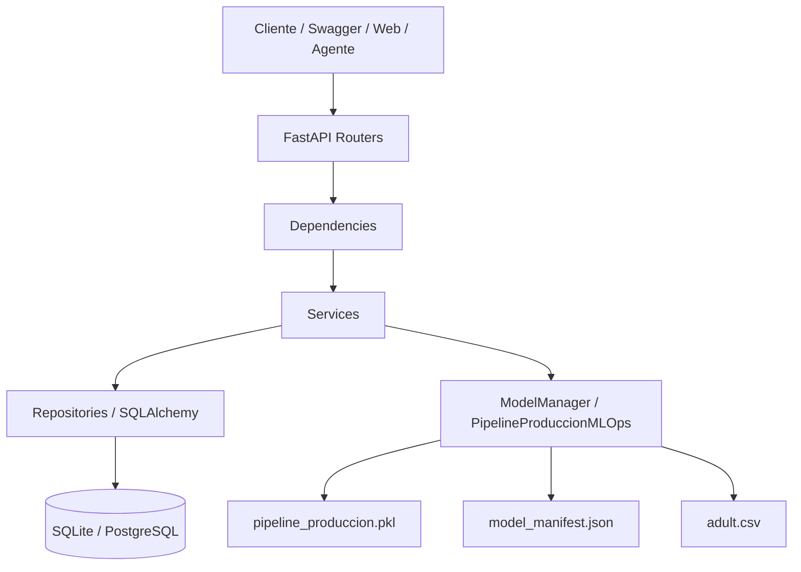

# 🧠 Oráculo Adult Income API

<p align="center">
  
  
  
  
  
  
  
</p>

<p align="center">
  API REST para inferencia del problema <strong>Adult Census Income</strong>, con autenticación, persistencia, trazabilidad, validaciones estrictas,
  middlewares de seguridad y una capa de compatibilidad entre el notebook de entrenamiento y el backend de producción.
</p>

---

## ✨ Qué es este proyecto

`oraculo_api` es el backend de inferencia estructurada del ecosistema Oráculo.

Su responsabilidad no es solamente “cargar un `.pkl` y responder una predicción”, sino construir una frontera sólida entre:

- el trabajo analítico hecho en notebook,
- el artefacto serializado del modelo,
- el contrato HTTP consumido por otras capas,
- la autenticación de usuarios,
- y la trazabilidad persistente de cada inferencia.

En términos prácticos, este servicio permite:

- registrar usuarios;
- autenticar con JWT;
- validar payloads del dataset Adult Income;
- ejecutar predicciones sobre el pipeline cargado;
- guardar historial por usuario;
- consultar predicciones anteriores;
- verificar salud de la API, del modelo y de la base de datos;
- desplegar localmente, en Docker, Render o Hugging Face Spaces.

> ⚠️ Además, el backend incluye una capa de compatibilidad para artefactos exportados desde notebook. Si el `.pkl` no serializa todas las recetas de feature engineering, la clase `PipelineProduccionMLOps` puede reconstruir parte de esas reglas a partir de artefactos y del dataset de referencia `adult.csv`.

---

## 🎯 Objetivo del backend

Esta API está diseñada para resolver cuatro necesidades del proyecto:

1. **Exponer inferencia de modelo como servicio HTTP estable y autenticado.**
2. **Blindar el salto notebook → backend**, evitando que el modelo quede atrapado en un entorno puramente exploratorio.
3. **Persistir evidencia operativa** de cada solicitud de predicción: payload, versión del modelo, request id, latencia y usuario.
4. **Servir como capa fuente de verdad** para otras aplicaciones del ecosistema, como el agente IA y la interfaz web.

---

## 🧱 Stack tecnológico

### Backend y servidor

- **FastAPI**: framework principal de la API.
- **Uvicorn**: servidor ASGI.
- **Starlette middlewares**: capa de compresión, hosts confiables y middleware base.
- **python-multipart**: soporte de cuerpos multipart cuando sea necesario.

### Configuración y seguridad

- **Pydantic v2**: validaciones, contratos de entrada y salida.
- **pydantic-settings**: configuración por variables de entorno.
- **python-dotenv**: soporte para `.env` local.
- **bcrypt**: hashing de contraseñas.
- **PyJWT**: creación y validación de tokens JWT.

### Persistencia y migraciones

- **SQLAlchemy 2.0**: ORM y acceso a base de datos.
- **Alembic**: migraciones versionadas.
- **SQLite** por defecto, con soporte para cambiar a **PostgreSQL** vía `DATABASE_URL`.

### ML y datos

- **joblib**: carga del artefacto serializado.
- **LightGBM**: modelo principal del pipeline.
- **numpy**, **pandas**, **scikit-learn**, **scipy**: base del pipeline tabular y de las transformaciones.

### Testing

- **pytest**: framework de pruebas.
- **httpx / TestClient**: validación de endpoints y contrato HTTP.
- **pytest-asyncio**: soporte adicional para contextos asíncronos de prueba.

---

## 📦 Dependencias exactas (`requirements.txt`)

### API / Web

- `fastapi==0.135.3`
- `uvicorn==0.44.0`
- `httptools==0.7.1`
- `watchfiles==1.1.1`
- `websockets==16.0`
- `python-multipart==0.0.26`

### Configuración / Seguridad

- `bcrypt==5.0.0`
- `PyJWT==2.12.1`
- `pydantic==2.12.5`
- `pydantic-settings==2.13.1`
- `python-dotenv==1.2.2`

### Base de datos / ORM / Migraciones

- `SQLAlchemy==2.0.49`
- `alembic==1.18.4`

### Machine Learning / Data

- `joblib==1.5.3`
- `lightgbm==4.6.0`
- `numpy==2.4.4`
- `pandas==3.0.2`
- `scikit-learn==1.8.0`
- `scipy==1.17.1`

### Testing

- `httpx==0.28.1`
- `pytest==9.0.3`
- `pytest-asyncio==1.3.0`

---

## 🗂️ Estructura real del proyecto

```text
oraculo_api/
├── .dockerignore
├── .env.example
├── Dockerfile
├── README.md
├── requirements.txt
├── alembic.ini
├── adult.csv
├── compas-scores-raw.csv
├── EDA_For_All_Tree_clean.ipynb
├── oraculo.db
├── alembic/
│   └── env.py
├── app/
│   ├── main.py
│   ├── api/
│   │   ├── dependencies.py
│   │   ├── router.py
│   │   └── v1/
│   │       ├── router.py
│   │       └── endpoints/
│   │           ├── auth.py
│   │           ├── health.py
│   │           └── predictions.py
│   ├── core/
│   │   ├── config.py
│   │   ├── error_handlers.py
│   │   ├── exceptions.py
│   │   ├── logging.py
│   │   ├── middleware.py
│   │   └── security.py
│   ├── db/
│   │   ├── __init__.py
│   │   ├── base.py
│   │   ├── session.py
│   │   ├── seeds.py
│   │   ├── models/
│   │   │   ├── __init__.py
│   │   │   ├── user.py
│   │   │   └── prediction_log.py
│   │   └── repositories/
│   │       ├── __init__.py
│   │       ├── users.py
│   │       └── predictions.py
│   ├── ml/
│   │   ├── custom_transformers.py
│   │   ├── model_manager.py
│   │   └── pipeline_produccion.pkl
│   ├── schemas/
│   │   ├── auth.py
│   │   ├── common.py
│   │   ├── health.py
│   │   └── prediction.py
│   └── services/
│       ├── __init__.py
│       ├── auth.py
│       ├── health.py
│       └── prediction.py
└── tests/
    ├── __init__.py
    ├── conftest.py
    └── api/
        ├── test_auth_api.py
        ├── test_health_api.py
        └── test_prediction_api.py
```

---

## 🧭 Arquitectura por capas



### Flujo interno de una predicción

1. El cliente envía un `POST /api/v1/predictions`.
2. FastAPI valida el payload con `PredictionInput`.
3. `get_current_user` exige un JWT válido.
4. `PredictionService` transforma el payload en dos versiones:
   - **input payload** con aliases del contrato HTTP;
   - **normalized payload** con nombres internos Python-friendly.
5. `ModelManager.predict_one()` ejecuta el pipeline cargado.
6. Se calcula la latencia.
7. `PredictionRepository.create()` persiste el evento completo en `prediction_logs`.
8. La respuesta vuelve con `id`, `prediction`, `probability`, `request_id`, `model_version` y payloads trazables.

---

## 🧠 Qué hace cada capa

### `app/main.py`

Es el punto de entrada de la aplicación.

Responsabilidades:

- crear la instancia FastAPI;
- configurar logging;
- inicializar `engine` y `session_factory`;
- crear tablas automáticamente si está habilitado;
- seedear un administrador inicial;
- cargar el modelo al arrancar;
- instalar middlewares;
- registrar handlers globales de error;
- exponer el endpoint raíz `/`.

### `app/api/`

Contiene la superficie HTTP del sistema.

- `router.py`: compone el router principal.
- `v1/router.py`: agrupa los endpoints bajo `/api/v1`.
- `v1/endpoints/auth.py`: registro, login y `me`.
- `v1/endpoints/health.py`: salud `live` y `ready`.
- `v1/endpoints/predictions.py`: creación, listado y consulta de predicciones.

### `app/api/dependencies.py`

Resuelve dependencias reutilizables de FastAPI:

- settings actuales;
- model manager cargado en `app.state`;
- sesiones de base de datos;
- repositorios;
- servicios;
- usuario autenticado;
- usuario administrador.

### `app/core/`

Es la capa transversal del backend.

- `config.py`: define `Settings`, lee variables de entorno y normaliza listas como `ALLOWED_HOSTS` y `CORS_ALLOW_ORIGINS`.
- `security.py`: hashing, verificación de passwords, creación y decodificación de JWT, extracción del bearer token.
- `middleware.py`: request id, client ip, headers de seguridad, límite de tamaño y rate limiting.
- `exceptions.py`: errores tipados de dominio y operación.
- `error_handlers.py`: respuestas JSON consistentes para errores esperados e inesperados.
- `logging.py`: configura logging estructurado a nivel global.

### `app/db/`

Contiene persistencia y modelo relacional.

- `base.py`: `DeclarativeBase`, naming convention y `TimestampMixin`.
- `session.py`: engine, factory de sesiones, chequeo de conexión y manejo transaccional.
- `models/user.py`: entidad `users`.
- `models/prediction_log.py`: entidad `prediction_logs`.
- `repositories/users.py`: consultas y creación de usuarios.
- `repositories/predictions.py`: creación, listado filtrado y consulta de predicciones por usuario.
- `seeds.py`: creación opcional del admin bootstrap.

### `app/services/`

Aquí está la lógica de negocio, separada del transporte HTTP.

- `AuthService`: registro, login y recuperación de usuario.
- `HealthService`: estado de vida y readiness real.
- `PredictionService`: inferencia, hashing de payload, persistencia y respuestas paginadas.

### `app/ml/`

Es la capa de integración con el artefacto del modelo.

- `model_manager.py`: carga el `.pkl`, lee `model_manifest.json`, verifica estado y expone `predict`, `predict_proba` y `predict_one`.
- `custom_transformers.py`: define `PipelineProduccionMLOps`, que actúa como puente de compatibilidad entre el notebook exportado y el backend.

### `app/schemas/`

Modelos Pydantic del contrato público.

- `auth.py`: DTOs de registro, login, token y usuario.
- `health.py`: respuestas de health.
- `prediction.py`: payload de entrada, detalle de predicción y lista paginada.
- `common.py`: base schema y metadatos de paginación.

### `tests/`

La suite prueba el contrato HTTP desacoplándolo del modelo real cuando conviene.

- `conftest.py` crea `FakeModelManager`, app de prueba, token, headers y payload válido.
- `test_auth_api.py` valida registro, conflicto, login y `me`.
- `test_health_api.py` valida raíz, `live` y `ready`.
- `test_prediction_api.py` valida autenticación, creación, filtros, aislamiento por usuario, payload grande, errores y recuperación por id.

---

## 🔐 Seguridad implementada

### Autenticación

- Login con email y password.
- Emisión de **JWT** firmado con `HS256` por defecto.
- Expiración configurable (`ORACULO_ACCESS_TOKEN_EXPIRE_MINUTES`).
- Endpoint `/api/v1/auth/me` para resolver el usuario autenticado.

### Contraseñas

- Hash con **bcrypt**.
- Si la contraseña supera el límite interno de bcrypt (72 bytes), el código hace **pre-hashing SHA-256** antes de `bcrypt.hashpw`, evitando truncamientos silenciosos.

### Validación de entrada

- `extra="forbid"` en esquemas sensibles para bloquear campos sorpresa.
- Validaciones de longitud, tipo y rango.
- Passwords fuertes obligatorias en registro:
  - mayúscula,
  - minúscula,
  - número,
  - carácter especial,
  - longitud mínima de 12.

### Middlewares defensivos

- **TrustedHostMiddleware** para hosts permitidos.
- **GZipMiddleware** para compresión de respuestas.
- **SecurityHeadersMiddleware** con:
  - `X-Content-Type-Options: nosniff`
  - `Referrer-Policy: no-referrer`
  - `Permissions-Policy`
  - `Cache-Control: no-store`
  - `Pragma: no-cache`
  - `Content-Security-Policy`
- **MaxRequestSizeMiddleware** para rechazar payloads demasiado grandes.
- **RateLimitMiddleware** in-memory por IP.
- **RequestContextMiddleware** para generar `X-Request-ID` y `X-Process-Time-MS`.

### Errores controlados

Todos los errores retornan JSON consistente bajo la forma:

```json
{
  "error": {
    "code": "validation_error",
    "message": "Request validation failed.",
    "detail": {},
    "request_id": "..."
  }
}
```

---

## 🗃️ Modelo de datos

### Tabla `users`

Campos principales:

- `id`
- `email`
- `full_name`
- `password_hash`
- `role`
- `is_active`
- `created_at`
- `updated_at`

### Tabla `prediction_logs`

Campos principales:

- `id`
- `user_id`
- `request_id`
- `ip_address`
- `label`
- `probability`
- `latency_ms`
- `model_version`
- `payload_hash`
- `input_payload`
- `normalized_payload`
- `notes`
- `created_at`
- `updated_at`

Esto convierte cada inferencia en un evento auditable y recuperable.

---

## 🤖 Integración con el modelo

### `ModelManager`

El `ModelManager` es el punto central de carga e inferencia. Se encarga de:

- cargar el artefacto `pipeline_produccion.pkl`;
- registrar una clase puente en `__main__` para que `joblib` pueda deserializar objetos definidos originalmente en notebook;
- intentar leer `model_manifest.json` si existe;
- exponer `predict`, `predict_proba` y `predict_one`;
- encapsular fallas como `ServiceUnavailableError` o `ModelInferenceError`.

### `PipelineProduccionMLOps`

Esta clase existe para hacer el artefacto más robusto en producción.

Responsabilidades principales:

- normalizar nombres de columnas (`snake_case`, puntos, caracteres raros);
- limpiar texto categórico;
- reconstruir recetas faltantes si el notebook no serializó todo correctamente;
- aplicar rare labeling;
- aplicar target encoding y mapeos binarios;
- reconstruir fórmulas derivadas;
- generar ratios matemáticos;
- aplicar winsorización;
- reusar escaladores si existen;
- eliminar columnas de fuga o basura si están declaradas;
- realinear el DataFrame final con las features esperadas por el modelo entrenado.

### Artefactos esperados

El backend espera, como mínimo:

- `app/ml/pipeline_produccion.pkl`

Y opcionalmente:

- `app/ml/model_manifest.json`

Adicionalmente, puede usar:

- `adult.csv` como dataset de referencia para recomponer recetas faltantes de ingeniería de features.

---

## 🌱 Variables de entorno

Crea un archivo `.env` local a partir de `.env.example`.

### Variables principales

| Variable                              | Descripción                                                        |
| ------------------------------------- | ------------------------------------------------------------------ |
| `ORACULO_APP_NAME`                    | Nombre público del servicio.                                       |
| `ORACULO_APP_VERSION`                 | Versión de la API.                                                 |
| `ORACULO_ENVIRONMENT`                 | Entorno (`local`, `development`, `test`, `staging`, `production`). |
| `ORACULO_DEBUG`                       | Activa modo debug.                                                 |
| `ORACULO_DATABASE_URL`                | URL de conexión a BD. Por defecto SQLite local.                    |
| `ORACULO_DATABASE_ECHO`               | Log SQL de SQLAlchemy.                                             |
| `ORACULO_AUTO_CREATE_TABLES`          | Crea tablas automáticamente al arrancar.                           |
| `ORACULO_AUTO_SEED_ADMIN`             | Activa siembra automática de admin.                                |
| `ORACULO_SEED_ADMIN_EMAIL`            | Email del admin bootstrap.                                         |
| `ORACULO_SEED_ADMIN_PASSWORD`         | Password del admin bootstrap.                                      |
| `ORACULO_SEED_ADMIN_NAME`             | Nombre visible del admin bootstrap.                                |
| `ORACULO_MODEL_PATH`                  | Ruta al `.pkl` de producción.                                      |
| `ORACULO_JWT_SECRET_KEY`              | Clave secreta JWT.                                                 |
| `ORACULO_JWT_ALGORITHM`               | Algoritmo JWT.                                                     |
| `ORACULO_ACCESS_TOKEN_EXPIRE_MINUTES` | Duración del token.                                                |
| `ORACULO_ALLOWED_HOSTS`               | Hosts permitidos.                                                  |
| `ORACULO_CORS_ALLOW_ORIGINS`          | Orígenes CORS permitidos.                                          |
| `ORACULO_MAX_REQUEST_SIZE_BYTES`      | Tamaño máximo del body.                                            |
| `ORACULO_RATE_LIMIT_ENABLED`          | Activa rate limit.                                                 |
| `ORACULO_RATE_LIMIT_REQUESTS`         | Número máximo de requests por ventana.                             |
| `ORACULO_RATE_LIMIT_WINDOW_SECONDS`   | Duración de la ventana.                                            |
| `ORACULO_DOCS_ENABLED`                | Activa/desactiva `/docs`, `/redoc` y `/openapi.json`.              |

### Ejemplo `.env`

```env
ORACULO_APP_NAME=Oraculo Adult Income API
ORACULO_APP_VERSION=2.0.0
ORACULO_ENVIRONMENT=development
ORACULO_DEBUG=false

ORACULO_DATABASE_URL=sqlite:///./oraculo.db
ORACULO_DATABASE_ECHO=false
ORACULO_AUTO_CREATE_TABLES=true
ORACULO_AUTO_SEED_ADMIN=true
ORACULO_SEED_ADMIN_EMAIL=admin@example.com
ORACULO_SEED_ADMIN_PASSWORD=ChangeMe!12345
ORACULO_SEED_ADMIN_NAME=Administrator

ORACULO_MODEL_PATH=app/ml/pipeline_produccion.pkl

ORACULO_JWT_SECRET_KEY=replace-this-with-a-long-random-secret-at-least-32-chars
ORACULO_JWT_ALGORITHM=HS256
ORACULO_ACCESS_TOKEN_EXPIRE_MINUTES=60

ORACULO_ALLOWED_HOSTS=localhost,127.0.0.1,*.hf.space,*.huggingface.co
ORACULO_CORS_ALLOW_ORIGINS=http://localhost:3000,http://127.0.0.1:3000

ORACULO_MAX_REQUEST_SIZE_BYTES=32768
ORACULO_RATE_LIMIT_ENABLED=true
ORACULO_RATE_LIMIT_REQUESTS=60
ORACULO_RATE_LIMIT_WINDOW_SECONDS=60

ORACULO_DOCS_ENABLED=true
```

---

## 🚀 Instalación local paso a paso

### 1) Clonar el proyecto

```bash
git clone https://github.com/DiiegoA/Proyecto_modelo_IA.git
cd Proyecto_modelo_IA/oraculo_api
```

### 2) Crear entorno virtual

#### Linux / macOS

```bash
python -m venv .venv
source .venv/bin/activate
```

#### Windows (PowerShell)

```powershell
python -m venv .venv
.\.venv\Scripts\Activate.ps1
```

### 3) Instalar dependencias

```bash
pip install --upgrade pip
pip install -r requirements.txt
```

### 4) Configurar variables de entorno

```bash
cp .env.example .env
```

En Windows, copia el archivo manualmente o usa el explorador.

### 5) Ejecutar migraciones

```bash
alembic upgrade head
```

### 6) Iniciar el servidor

```bash
uvicorn app.main:app --reload
```

### 7) Abrir documentación interactiva

- Swagger UI: `http://127.0.0.1:8000/docs`
- ReDoc: `http://127.0.0.1:8000/redoc`

---

## 🧪 Cómo probar la API

### Health checks

```bash
curl http://127.0.0.1:8000/
curl http://127.0.0.1:8000/api/v1/health/live
curl http://127.0.0.1:8000/api/v1/health/ready
```

### Registrar usuario

```bash
curl -X POST http://127.0.0.1:8000/api/v1/auth/register \
  -H "Content-Type: application/json" \
  -d '{
    "email": "user@example.com",
    "full_name": "Test User",
    "password": "StrongPass!123"
  }'
```

### Login

```bash
curl -X POST http://127.0.0.1:8000/api/v1/auth/login \
  -H "Content-Type: application/json" \
  -d '{
    "email": "user@example.com",
    "password": "StrongPass!123"
  }'
```

### Crear predicción

```bash
curl -X POST http://127.0.0.1:8000/api/v1/predictions \
  -H "Content-Type: application/json" \
  -H "Authorization: Bearer TU_TOKEN" \
  -d '{
    "age": 45,
    "workclass": "Private",
    "fnlwgt": 250000,
    "education": "Masters",
    "education.num": 14,
    "marital.status": "Married-civ-spouse",
    "occupation": "Exec-managerial",
    "relationship": "Husband",
    "race": "White",
    "sex": "Male",
    "capital.gain": 15000,
    "capital.loss": 0,
    "hours.per.week": 50,
    "native.country": "United-States"
  }'
```

### Listar historial

```bash
curl -H "Authorization: Bearer TU_TOKEN" \
  "http://127.0.0.1:8000/api/v1/predictions?skip=0&limit=20"
```

### Filtrar historial

```bash
curl -H "Authorization: Bearer TU_TOKEN" \
  "http://127.0.0.1:8000/api/v1/predictions?label=%3E50K&min_probability=0.8"
```

### Consultar una predicción por id

```bash
curl -H "Authorization: Bearer TU_TOKEN" \
  http://127.0.0.1:8000/api/v1/predictions/PREDICTION_ID
```

---

## 📡 Endpoints disponibles

### Salud

| Método | Ruta                   | Descripción                              |
| ------ | ---------------------- | ---------------------------------------- |
| `GET`  | `/`                    | Metadatos básicos del servicio.          |
| `GET`  | `/api/v1/health/live`  | Verifica que la API está viva.           |
| `GET`  | `/api/v1/health/ready` | Verifica base de datos + modelo cargado. |

### Autenticación

| Método | Ruta                    | Descripción                 |
| ------ | ----------------------- | --------------------------- |
| `POST` | `/api/v1/auth/register` | Registro de usuario.        |
| `POST` | `/api/v1/auth/login`    | Login y emisión de token.   |
| `GET`  | `/api/v1/auth/me`       | Usuario autenticado actual. |

### Predicciones

| Método | Ruta                                  | Descripción                                  |
| ------ | ------------------------------------- | -------------------------------------------- |
| `POST` | `/api/v1/predictions`                 | Ejecuta una predicción y la persiste.        |
| `GET`  | `/api/v1/predictions`                 | Lista historial paginado del usuario.        |
| `GET`  | `/api/v1/predictions/{prediction_id}` | Recupera una predicción puntual del usuario. |

---

## 🧾 Contrato de entrada para predicción

El payload que espera la API está alineado con el dataset Adult Income y admite aliases con puntos:

| Campo HTTP       | Campo normalizado | Tipo             |
| ---------------- | ----------------- | ---------------- |
| `age`            | `age`             | `int`            |
| `workclass`      | `workclass`       | `str`            |
| `fnlwgt`         | `fnlwgt`          | `int`            |
| `education`      | `education`       | `str`            |
| `education.num`  | `education_num`   | `int`            |
| `marital.status` | `marital_status`  | `str`            |
| `occupation`     | `occupation`      | `str`            |
| `relationship`   | `relationship`    | `str`            |
| `race`           | `race`            | `str`            |
| `sex`            | `sex`             | `Male \| Female` |
| `capital.gain`   | `capital_gain`    | `int`            |
| `capital.loss`   | `capital_loss`    | `int`            |
| `hours.per.week` | `hours_per_week`  | `int`            |
| `native.country` | `native_country`  | `str`            |

### Reglas de validación destacadas

- `age`: entre `17` y `100`
- `fnlwgt`: entre `1` y `2_000_000`
- `education.num`: entre `1` y `16`
- `capital.gain`: entre `0` y `100_000`
- `capital.loss`: entre `0` y `10_000`
- `hours.per.week`: entre `1` y `99`
- categorías no vacías, sin caracteres de control y con longitud máxima razonable

---

## 📚 Respuesta de predicción

Una predicción devuelve información útil tanto para negocio como para auditoría:

```json
{
  "id": "uuid",
  "prediction": ">50K",
  "probability": 0.91,
  "is_counterfactual_applied": false,
  "execution_time_ms": 12.34,
  "model_version": "1.0.0",
  "request_id": "uuid",
  "created_at": "2026-01-01T00:00:00Z",
  "input_payload": {},
  "normalized_payload": {}
}
```

### Diferencia entre `input_payload` y `normalized_payload`

- `input_payload`: conserva la forma del contrato HTTP, incluyendo aliases como `education.num`.
- `normalized_payload`: usa nombres internos Python (`education_num`, `hours_per_week`, etc.).

Esto es útil para depuración, auditoría y trazabilidad del contrato público frente al contrato interno.

---

## 🧪 Tests

La suite existente valida el comportamiento público del backend con una estrategia pragmática:

### Qué se prueba

- registro exitoso;
- rechazo por usuario duplicado;
- login correcto;
- login con credenciales inválidas;
- endpoint `/me` protegido;
- raíz `/`;
- `health/live` y `health/ready`;
- creación de predicción autenticada;
- rechazo de payload inválido;
- rechazo de payload excesivo;
- filtros por `label` y `min_probability`;
- consulta por `prediction_id`;
- aislamiento de historial entre usuarios;
- mapeo controlado de errores del modelo.

### Cómo se ejecutan

```bash
pytest -q
```

### Estrategia de pruebas

La suite usa un `FakeModelManager` en `tests/conftest.py` para:

- desacoplar el contrato HTTP del artefacto real;
- acelerar las pruebas;
- validar reglas de negocio y seguridad sin depender siempre del `.pkl`.

---

## 🛠️ Migraciones con Alembic

### Aplicar migraciones

```bash
alembic upgrade head
```

### Crear una nueva migración

```bash
alembic revision --autogenerate -m "descripcion"
```

### Revertir una migración

```bash
alembic downgrade -1
```

### Qué hace `alembic/env.py`

- carga `Settings` reales del entorno;
- inyecta `settings.database_url` en la configuración de Alembic;
- usa `Base.metadata` como fuente de verdad del esquema;
- permite migraciones offline y online.

---

## 👤 Seed automático de administrador

Si activas estas variables:

```env
ORACULO_AUTO_SEED_ADMIN=true
ORACULO_SEED_ADMIN_EMAIL=admin@example.com
ORACULO_SEED_ADMIN_PASSWORD=ChangeMe!12345
ORACULO_SEED_ADMIN_NAME=Administrator
```

al arrancar la aplicación se crea un administrador si no existe uno previo con ese email.

Esto es útil para bootstrap local, demos o primeros despliegues.

---

## 🐳 Docker

### Qué hace el `Dockerfile`

- usa `python:3.11-slim` como base;
- instala `libgomp1` para dependencias del stack de ML;
- crea un usuario no root;
- instala dependencias desde `requirements.txt`;
- copia el proyecto completo al contenedor;
- expone el puerto `7860`;
- ejecuta `alembic upgrade head` antes de levantar Uvicorn.

### Construcción

```bash
docker build -t oraculo-api .
```

### Ejecución

```bash
docker run --rm -p 7860:7860 --env-file .env oraculo-api
```

### Comando final del contenedor

```bash
alembic upgrade head && uvicorn app.main:app --host 0.0.0.0 --port 7860
```

---

## 🤗 Despliegue en Hugging Face Spaces

Este repositorio ya está preparado para un **Docker Space**.

### Puntos importantes

- El front matter al inicio del README define `sdk: docker`, `app_port: 7860` y `base_path: /docs`.
- El contenedor escucha en `7860`.
- Swagger queda accesible en `/docs`.
- Los headers de seguridad contemplan el caso especial de embebido en dominios `*.hf.space` y `*.huggingface.co`.

### Variables mínimas recomendadas en Spaces

- `ORACULO_JWT_SECRET_KEY`
- `ORACULO_ALLOWED_HOSTS`
- `ORACULO_DOCS_ENABLED`
- `ORACULO_DATABASE_URL`
- `ORACULO_SEED_ADMIN_EMAIL`
- `ORACULO_SEED_ADMIN_PASSWORD`

### Persistencia en Spaces

Si quieres que SQLite sobreviva reinicios, usa almacenamiento persistente y configura:

```env
ORACULO_DATABASE_URL=sqlite:////data/oraculo.db
```

---

## ☁️ Despliegue en Render

### Start Command sugerido

```bash
alembic upgrade head && uvicorn app.main:app --host 0.0.0.0 --port $PORT
```

### Variables mínimas recomendadas

```env
ORACULO_ENVIRONMENT=production
ORACULO_DATABASE_URL=<postgres-url>
ORACULO_JWT_SECRET_KEY=<secret-largo>
ORACULO_ALLOWED_HOSTS=<tu-dominio>
ORACULO_DOCS_ENABLED=false
```

---

## 🧯 Troubleshooting

### 1. El modelo no carga

Revisa:

- que `ORACULO_MODEL_PATH` apunte realmente a `app/ml/pipeline_produccion.pkl`;
- que el archivo exista dentro del contenedor o del entorno local;
- que `joblib` pueda deserializar el artefacto;
- que, si usas un manifiesto, `model_manifest.json` esté bien formado.

### 2. `ready` devuelve degradado o error

Revisa:

- conexión a la base de datos;
- permisos del archivo SQLite;
- existencia del `.pkl`;
- carga correcta del modelo al arrancar.

### 3. El `App` tab de Hugging Face no muestra la app aunque `/docs` responde

Esto suele estar relacionado con headers de embebido. El proyecto ya contempla el caso `*.hf.space`, pero vale la pena revisar:

- `ORACULO_ALLOWED_HOSTS`;
- si el Space tiene la última versión desplegada;
- si hiciste `Factory reboot` tras cambios de seguridad;
- si `ORACULO_DOCS_ENABLED=true`.

### 4. SQLite se reinicia

Si el proveedor no tiene almacenamiento persistente, la BD local es efímera. En producción real, usa Postgres o un volumen persistente.

---

## 📈 Mejoras futuras naturales

Si quieres endurecer todavía más esta API, las siguientes mejoras son coherentes con la arquitectura actual:

- rate limiting distribuido con Redis;
- refresh tokens;
- observabilidad con Prometheus u OpenTelemetry;
- roles más finos (`admin`, `analyst`, `service`);
- pipeline CI con lint, type-check y cobertura;
- separación formal entre API pública e interna;
- Postgres como default de desarrollo colaborativo;
- versionado explícito del contrato de inferencia y del manifiesto del modelo.

---

## ✅ Resumen ejecutivo

`oraculo_api` ya no es un backend improvisado alrededor de un notebook.

Hoy es una base con:

- arquitectura por capas;
- contrato HTTP claro;
- autenticación JWT;
- hashing robusto de contraseñas;
- middlewares de seguridad;
- validación estricta de payloads;
- persistencia auditada de predicciones;
- health checks reales;
- migraciones con Alembic;
- compatibilidad con artefactos exportados desde notebook;
- pruebas automatizadas sobre el contrato principal.

En otras palabras: esta carpeta es la **capa de inferencia seria y trazable** del ecosistema Oráculo.

---

## 📌 Recomendación final de uso

Si alguien entra por primera vez a `oraculo_api`, el orden ideal para entenderlo es:

1. `README.md`
2. `app/main.py`
3. `app/api/v1/endpoints/`
4. `app/services/`
5. `app/db/`
6. `app/ml/model_manager.py`
7. `app/ml/custom_transformers.py`
8. `tests/`

Ese recorrido permite entender primero la interfaz pública, luego la lógica de negocio, después la persistencia y, por último, la capa de compatibilidad del modelo.
