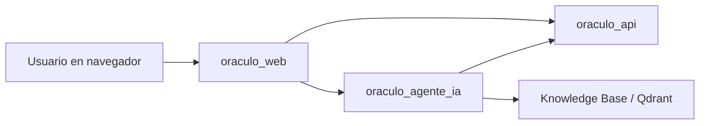

# 🌐 Oraculo Web


Interfaz web del ecosistema **Oráculo** construida con **FastAPI** que actúa como capa de experiencia de usuario para el sistema completo.

No es únicamente una landing ni un frontend estático: este módulo hace de **puerta de entrada unificada** para que el usuario pueda:

- registrarse e iniciar sesión contra `oraculo_api`;
- conservar la sesión mediante cookie del servidor;
- conversar con `oraculo_agente_ia` sin manipular manualmente tokens JWT;
- mantener continuidad conversacional con `thread_id` persistido en navegador;
- consultar y cargar documentos al knowledge base del agente desde la propia web.

En otras palabras, `oraculo_web` convierte la arquitectura técnica del proyecto en una experiencia operable desde navegador.

---

## ✨ Qué resuelve este módulo

Antes de esta capa, para usar el sistema completo había que interactuar por separado con:

- la API de autenticación e inferencia (`oraculo_api`),
- el agente conversacional (`oraculo_agente_ia`),
- y en algunos casos los endpoints administrativos del knowledge base.

`oraculo_web` encapsula ese flujo y entrega una interfaz única donde el usuario:

1. crea cuenta o inicia sesión;
2. obtiene una sesión persistida por cookie del servidor;
3. envía mensajes a AdultBot desde un panel conversacional;
4. recibe respuestas de tipo `chat`, `prediction`, `rag`, `hybrid`, `clarification` o `unsafe`;
5. puede inspeccionar fuentes del RAG y subir documentos compatibles.

---

## 🧭 Rol de `oraculo_web` dentro de la arquitectura general



### Función exacta de esta capa

- **No ejecuta el modelo tabular** de Adult Income por sí misma.
- **No implementa el grafo agentic** del asistente.
- **No reemplaza la seguridad del backend principal**.

Su responsabilidad real es servir como:

- **frontend HTML/CSS/JS**;
- **backend web liviano** con rutas `/api/...` propias;
- **proxy seguro** hacia `oraculo_api` y `oraculo_agente_ia`;
- **manejador de sesión** para navegación web;
- **adaptador de experiencia** entre el usuario humano y los servicios backend.

---

## 🗂️ Estructura del módulo

```text
oraculo_web/
├── app/
│   ├── main.py
│   ├── config.py
│   ├── gateway.py
│   ├── schemas.py
│   └── static/
│       ├── index.html
│       ├── app.js
│       └── styles.css
├── tests/
│   └── conftest.py
├── .env.example
├── .dockerignore
├── Dockerfile
├── README.md
└── requirements.txt
```

---

## 🧱 Descripción detallada de cada archivo principal

### `app/main.py`

Es el **núcleo de la aplicación web**.

Aquí se define y configura la instancia `FastAPI`, y se montan todas las piezas que convierten el módulo en un gateway funcional.

#### Qué hace concretamente

- crea la aplicación con `title`, `version`, `debug`, `docs_url`, `redoc_url` y `openapi_url`;
- inyecta en `application.state` la configuración y el gateway remoto;
- añade middlewares de:
  - `GZipMiddleware`,
  - `SessionMiddleware`,
  - `TrustedHostMiddleware`;
- monta `/static` para servir los archivos frontend;
- define manejadores controlados para:
  - errores del gateway (`GatewayError`),
  - errores de validación (`RequestValidationError`);
- expone la interfaz HTML principal en `/`;
- expone endpoints web propios para auth, chat y knowledge.

#### Flujo de sesión en `main.py`

La sesión se almacena en `request.session` usando `SessionMiddleware`. Cuando un usuario se autentica con éxito:

- se limpia la sesión anterior;
- se guarda `access_token`;
- se guarda `user`;
- y a partir de ahí la web reusa ese token para invocar el agente y consultar el perfil.

Esto evita que el usuario tenga que copiar y pegar el bearer token manualmente desde Swagger.

---

### `app/config.py`

Este archivo centraliza toda la **configuración por variables de entorno** del módulo web.

#### Responsabilidades

- carga `.env` con prefijo `ORACULO_WEB_`;
- valida los tipos con `pydantic-settings`;
- normaliza `allowed_hosts`;
- limpia slash final de las URLs remotas;
- define parámetros de sesión y timeouts.

#### Parámetros más importantes

- nombre y versión de la app;
- activación o desactivación de docs OpenAPI;
- timeout para requests remotos;
- URL base de `oraculo_api`;
- URL base de `oraculo_agente_ia`;
- llave administrativa del agente para endpoints de knowledge;
- secreto de sesión y nombre de la cookie;
- hosts permitidos.

---

### `app/gateway.py`

Este archivo es el **adaptador HTTP** entre la web y los servicios remotos.

Es una de las piezas más importantes del módulo, porque concentra toda la comunicación saliente hacia:

- `oraculo_api` para auth;
- `oraculo_agente_ia` para chat y administración del RAG.

#### Qué hace

- envía requests autenticados o no autenticados a servicios remotos;
- convierte errores remotos en `GatewayError` con estructura consistente;
- protege la UI frente a payloads inesperados del upstream;
- encapsula los métodos de negocio usados por `main.py`.

#### Métodos implementados

- `register(...)`
- `login(...)`
- `me(...)`
- `invoke_chat(...)`
- `upload_knowledge_document(...)`
- `list_knowledge_sources(...)`

#### Manejo de errores

Si un remoto falla, el gateway:

- captura `httpx.HTTPError`;
- devuelve `upstream_unreachable` con status `502`;
- o traduce el error remoto a un `GatewayError` con:
  - `status_code`,
  - `code`,
  - `message`,
  - `detail`.

También añade una traducción útil en endpoints de knowledge: si el agente devuelve `403`, la web muestra que la **llave administrativa no coincide con el deploy remoto**.

---

### `app/schemas.py`

Aquí viven los contratos Pydantic del módulo web.

#### Modelos incluidos

- `ErrorEnvelope`
- `RegisterRequest`
- `LoginRequest`
- `SessionUser`
- `SessionResponse`
- `ChatInvokeRequest`

#### Qué se valida aquí

- longitudes mínimas y máximas de email, password y nombre;
- estructura de la respuesta de sesión;
- contrato del mensaje enviado al agente;
- shape uniforme de errores para el frontend.

---

### `app/static/index.html`

Es la interfaz principal del workspace web.

#### Qué contiene visualmente

- **topbar** con marca “AdultBot” y descripción del workspace;
- **panel de sesión** con login y registro;
- **panel lateral de capacidades** con quick actions;
- **panel de carga de documentos** para alimentar el RAG;
- **panel central de conversación** con stream de mensajes y composer.

#### Componentes de UI relevantes

- alternador entre login y registro;
- card de sesión activa;
- lista explicativa de rutas del agente;
- botones de muestra para casos típicos (`Saludar`, `Predicción`, `RAG`, etc.);
- visor de fuentes documentales cargadas;
- botón de reinicio de hilo;
- textarea para prompts largos.

---

### `app/static/app.js`

Es la lógica cliente del navegador.

Este archivo maneja el estado del frontend sin framework adicional.

#### Estado principal mantenido en frontend

```js
{
  (currentUser, threadId, messages, statusTimer);
}
```

#### Qué hace `app.js`

- conserva `threadId` en `localStorage`;
- cambia entre vista de login y registro;
- hace requests a `/api/...` del backend web;
- renderiza mensajes del usuario y del asistente;
- representa visualmente:
  - badges de ruta,
  - cards de predicción,
  - citas RAG,
  - flags de seguridad;
- maneja quick actions;
- carga y refresca fuentes del knowledge base;
- reinicia la conversación local;
- muestra notificaciones tipo toast.

#### Comportamientos importantes

##### Persistencia de hilo

Si el agente devuelve `thread_id`, el frontend lo guarda en:

```js
window.localStorage.setItem("oraculo_web.thread_id", state.threadId);
```

Eso permite continuidad conversacional entre mensajes y recargas del navegador.

##### Render dinámico según tipo de respuesta

La UI puede mostrar, dentro de un mensaje del asistente:

- respuesta natural;
- resultado del modelo (`prediction_result`);
- lista de `citations`;
- `safety_flags`.

##### Mensajes rápidos preconfigurados

`SAMPLE_MESSAGES` incluye ejemplos listos para:

- saludo;
- consulta de capacidades;
- predicción completa en un solo prompt;
- pregunta documental del proyecto.

---

### `app/static/styles.css`

Controla toda la presentación visual del workspace.

#### Rasgos de diseño implementados

- layout de dos columnas con sidebar + stage principal;
- estética tipo glassmorphism ligera;
- tipografías `Plus Jakarta Sans` e `IBM Plex Mono`;
- badges y pills por ruta del agente;
- cards diferenciadas para mensajes, predicciones, citas y flags;
- responsive layout para pantallas medianas y móviles;
- sistema visual coherente con variables CSS globales.

#### Clases semánticas importantes

- `.route-chat`
- `.route-prediction`
- `.route-rag`
- `.route-hybrid`
- `.route-clarification`
- `.route-unsafe`

Estas clases ayudan a que la ruta decidida por el agente no sea solo un dato técnico, sino una señal visual comprensible para el usuario.

---

### `tests/conftest.py`

El entorno de pruebas usa un `FakeGateway` para aislar la web del estado real de los servicios externos.

#### Qué simula

- registro;
- login;
- consulta de sesión (`me`);
- chat remoto;
- upload de documentos al knowledge base;
- listado de fuentes RAG.

Esto permite probar `oraculo_web` sin depender de que `oraculo_api` y `oraculo_agente_ia` estén levantados realmente.

---

### `Dockerfile`

Define la imagen de despliegue del módulo.

#### Qué hace

- usa `python:3.11-slim`;
- desactiva bytecode y cache pip;
- crea un usuario no root;
- instala dependencias desde `requirements.txt`;
- copia `app/` y `README.md`;
- expone el puerto `7860`;
- arranca con:

```bash
uvicorn app.main:app --host 0.0.0.0 --port 7860
```

---

## 📦 Dependencias de `requirements.txt` explicadas una por una

```txt
fastapi==0.135.3
uvicorn==0.44.0
httpx==0.28.1
itsdangerous==2.2.0
python-multipart==0.0.20
pydantic==2.12.5
pydantic-settings==2.13.1
python-dotenv==1.2.2
pytest==9.0.3
```

### Tabla de dependencias

| Dependencia         | Para qué se usa en `oraculo_web`                                                                                |
| ------------------- | --------------------------------------------------------------------------------------------------------------- |
| `fastapi`           | Framework principal del backend web. Define rutas, validación, manejo de errores y documentación OpenAPI.       |
| `uvicorn`           | Servidor ASGI para ejecutar la app localmente y en contenedor.                                                  |
| `httpx`             | Cliente HTTP usado por `OraculoGateway` para hablar con `oraculo_api` y `oraculo_agente_ia`.                    |
| `itsdangerous`      | Dependencia utilizada internamente por el sistema de sesiones firmado del middleware de Starlette/FastAPI.      |
| `python-multipart`  | Necesaria para procesar formularios multipart, especialmente la subida de documentos a `/api/knowledge/upload`. |
| `pydantic`          | Validación de contratos de entrada y salida.                                                                    |
| `pydantic-settings` | Carga y tipado de variables de entorno desde `.env`.                                                            |
| `python-dotenv`     | Permite leer variables de entorno locales desde archivo.                                                        |
| `pytest`            | Base de la suite de pruebas del módulo web.                                                                     |

### Instalación de dependencias

Desde la carpeta `oraculo_web/`:

```bash
python -m venv .venv
```

En Windows:

```bash
.venv\Scripts\activate
```

En macOS/Linux:

```bash
source .venv/bin/activate
```

Luego instala:

```bash
pip install --upgrade pip
pip install -r requirements.txt
```

---

## ⚙️ Variables de entorno

Toma como base `.env.example`.

### Ejemplo completo

```env
ORACULO_WEB_APP_NAME=Oraculo Web
ORACULO_WEB_APP_VERSION=1.0.0
ORACULO_WEB_ENVIRONMENT=development
ORACULO_WEB_DEBUG=false

ORACULO_WEB_ORACULO_API_BASE_URL=https://diiegoal-oraculo-api.hf.space
ORACULO_WEB_ORACULO_AGENT_BASE_URL=https://diiegoal-oraculo-agente-ia.hf.space
ORACULO_WEB_ORACULO_AGENT_ADMIN_API_KEY=change-this-agent-admin-key
ORACULO_WEB_REQUEST_TIMEOUT_SECONDS=30

ORACULO_WEB_SESSION_SECRET_KEY=change-this-session-secret-key
ORACULO_WEB_SESSION_COOKIE_NAME=oraculo_web_session
ORACULO_WEB_SESSION_COOKIE_HTTPS_ONLY=false
ORACULO_WEB_SESSION_MAX_AGE_SECONDS=86400

ORACULO_WEB_ALLOWED_HOSTS=localhost,127.0.0.1,testserver
```

### Explicación variable por variable

| Variable                                  | Significado                                                               |
| ----------------------------------------- | ------------------------------------------------------------------------- |
| `ORACULO_WEB_APP_NAME`                    | Nombre visible de la aplicación.                                          |
| `ORACULO_WEB_APP_VERSION`                 | Versión del módulo web.                                                   |
| `ORACULO_WEB_ENVIRONMENT`                 | Entorno (`development`, `test`, `production`, etc.).                      |
| `ORACULO_WEB_DEBUG`                       | Activa modo debug de FastAPI.                                             |
| `ORACULO_WEB_ORACULO_API_BASE_URL`        | URL base del backend de autenticación e inferencia.                       |
| `ORACULO_WEB_ORACULO_AGENT_BASE_URL`      | URL base del backend agentic.                                             |
| `ORACULO_WEB_ORACULO_AGENT_ADMIN_API_KEY` | Llave que la web reenvía en endpoints administrativos del knowledge base. |
| `ORACULO_WEB_REQUEST_TIMEOUT_SECONDS`     | Timeout HTTP para requests a remotos.                                     |
| `ORACULO_WEB_SESSION_SECRET_KEY`          | Secreto criptográfico para firmar la cookie de sesión.                    |
| `ORACULO_WEB_SESSION_COOKIE_NAME`         | Nombre de la cookie de sesión.                                            |
| `ORACULO_WEB_SESSION_COOKIE_HTTPS_ONLY`   | Si la cookie solo viaja por HTTPS.                                        |
| `ORACULO_WEB_SESSION_MAX_AGE_SECONDS`     | Duración máxima de la sesión.                                             |
| `ORACULO_WEB_ALLOWED_HOSTS`               | Hosts permitidos por `TrustedHostMiddleware`.                             |

### Recomendación de seguridad

En producción deberías cambiar al menos:

- `ORACULO_WEB_SESSION_SECRET_KEY`
- `ORACULO_WEB_ORACULO_AGENT_ADMIN_API_KEY`
- `ORACULO_WEB_SESSION_COOKIE_HTTPS_ONLY=true`

---

## 🚀 Ejecución local paso a paso

### 1. Entrar a la carpeta

```bash
cd oraculo_web
```

### 2. Crear y activar entorno virtual

```bash
python -m venv .venv
```

Windows:

```bash
.venv\Scripts\activate
```

macOS/Linux:

```bash
source .venv/bin/activate
```

### 3. Instalar dependencias

```bash
pip install --upgrade pip
pip install -r requirements.txt
```

### 4. Crear archivo `.env`

```bash
copy .env.example .env
```

O en macOS/Linux:

```bash
cp .env.example .env
```

### 5. Ajustar URLs remotas

Verifica que estas dos variables apunten a tus despliegues correctos:

```env
ORACULO_WEB_ORACULO_API_BASE_URL=...
ORACULO_WEB_ORACULO_AGENT_BASE_URL=...
```

### 6. Levantar la app

```bash
uvicorn app.main:app --reload --port 3000
```

### 7. Abrir en navegador

```txt
http://127.0.0.1:3000
```

### 8. Docs de FastAPI del módulo web

```txt
http://127.0.0.1:3000/docs
```

---

## 🔄 Flujo funcional completo

### Flujo de autenticación

1. El usuario llena login o registro en la UI.
2. `oraculo_web` envía la petición a `oraculo_api`.
3. Si sale bien, guarda `access_token` y `user` en sesión.
4. A partir de ahí la web reutiliza esa sesión para chat y knowledge.

### Flujo conversacional

1. El usuario escribe un mensaje en el composer.
2. El frontend llama a `/api/chat/invoke` de `oraculo_web`.
3. La web extrae el token desde sesión.
4. `OraculoGateway` reenvía el request a `oraculo_agente_ia`.
5. El agente decide la ruta (`chat`, `prediction`, `rag`, etc.).
6. La respuesta se renderiza con badges, citas, cards de predicción y flags si aplica.
7. El `thread_id` se guarda en `localStorage`.

### Flujo de knowledge upload

1. El usuario selecciona un archivo compatible.
2. La web lo manda como multipart a `/api/knowledge/upload`.
3. El backend web reenvía el archivo al agente con:
   - bearer token del usuario,
   - `X-Agent-Admin-Key`.
4. El agente indexa el documento en su knowledge base.
5. La web refresca el listado de fuentes cargadas.

---

## 🔌 Endpoints del módulo web

### Salud

| Método | Ruta               | Función                             |
| ------ | ------------------ | ----------------------------------- |
| `GET`  | `/api/health/live` | Health check simple del módulo web. |

### Autenticación

| Método | Ruta                 | Función                                           |
| ------ | -------------------- | ------------------------------------------------- |
| `POST` | `/api/auth/register` | Registra usuario y abre sesión automáticamente.   |
| `POST` | `/api/auth/login`    | Inicia sesión y guarda el token en cookie.        |
| `GET`  | `/api/auth/me`       | Recupera el usuario actual a partir de la sesión. |
| `POST` | `/api/auth/logout`   | Elimina la sesión activa.                         |

### Chat

| Método | Ruta               | Función                                               |
| ------ | ------------------ | ----------------------------------------------------- |
| `POST` | `/api/chat/invoke` | Reenvía mensajes al agente usando el token de sesión. |

### Knowledge

| Método | Ruta                     | Función                                                |
| ------ | ------------------------ | ------------------------------------------------------ |
| `GET`  | `/api/knowledge/sources` | Lista fuentes del knowledge base.                      |
| `POST` | `/api/knowledge/upload`  | Sube un documento para indexarlo en el RAG del agente. |

---

## 🧠 Experiencia de usuario implementada

### Modo de autenticación dual

La interfaz permite cambiar entre:

- `Entrar`
- `Crear cuenta`

sin salir de la misma pantalla.

### Workspace tipo chat-first

El foco visual está en la conversación, no en formularios pesados ni dashboards tradicionales.

### Continuidad conversacional

El frontend mantiene `thread_id` y puede continuar el hilo aunque el usuario haga varias consultas seguidas.

### Quick actions

Hay acciones rápidas para reducir fricción y mostrar casos de uso reales del sistema.

### Upload de conocimiento desde UI

No hace falta usar Swagger del agente para enriquecer el RAG: la propia web ya expone una experiencia de carga documental.

---

## 🔐 Seguridad aplicada

Aunque este módulo es liviano, ya implementa medidas importantes:

### 1. `SessionMiddleware`

Permite persistir sesión de usuario en la web sin que el frontend tenga que almacenar directamente el bearer en JavaScript visible.

### 2. `TrustedHostMiddleware`

Restringe hosts válidos según `allowed_hosts`.

### 3. Validación fuerte con Pydantic

Los payloads de login, registro y chat tienen contratos estrictos.

### 4. Encapsulación de errores upstream

La web no expone respuestas arbitrarias ni HTML rotos de los servicios remotos; traduce todo a `GatewayError` consistente.

### 5. Llave administrativa separada para knowledge

Los endpoints administrativos del agente requieren `X-Agent-Admin-Key`, y la web la inyecta desde configuración del servidor, no desde el usuario final.

---

## 🧪 Testing

La infraestructura de pruebas disponible usa un `FakeGateway` para simular los servicios remotos.

Eso permite validar el comportamiento de `oraculo_web` sin depender del estado real de:

- `oraculo_api`,
- `oraculo_agente_ia`,
- despliegues externos,
- ni credenciales reales.

### Qué áreas cubre el entorno de prueba

- registro;
- login;
- consulta de sesión;
- invocación de chat;
- subida de documentos al knowledge base;
- listado de fuentes del RAG.

### Ejecutar pruebas

```bash
pytest -q
```

---

## 🐳 Docker

### Construcción de imagen

```bash
docker build -t oraculo-web .
```

### Ejecución local con Docker

```bash
docker run --rm -p 7860:7860 \
  -e ORACULO_WEB_ORACULO_API_BASE_URL=https://tu-api \
  -e ORACULO_WEB_ORACULO_AGENT_BASE_URL=https://tu-agente \
  -e ORACULO_WEB_SESSION_SECRET_KEY=una-clave-segura \
  -e ORACULO_WEB_ORACULO_AGENT_ADMIN_API_KEY=tu-admin-key \
  oraculo-web
```

### URL esperada

```txt
http://127.0.0.1:7860
```

---

## 🛠️ Casos de uso reales que soporta la web

### Caso 1: conversación simple

El usuario entra y escribe:

```txt
Hola
```

La web reenvía el mensaje al agente y renderiza una respuesta `chat`.

### Caso 2: predicción completa en un solo prompt

```txt
Quiero una predicción de ingresos en un solo prompt. Tengo 39 años, mi tipo de trabajo es Private...
```

La web envía el mensaje tal como está y renderiza:

- respuesta del agente,
- badge `prediction`,
- resultado del modelo,
- probabilidad,
- versión del modelo.

### Caso 3: pregunta documental

```txt
Explícame qué endpoint usa el agente para conversar y cómo protege sus endpoints.
```

La web mostrará una respuesta `rag` o `hybrid` con citas cuando existan.

### Caso 4: carga manual de documentos al RAG

El usuario autenticado sube un `.md`, `.txt`, `.json`, `.csv` o `.pdf`, y el documento pasa a formar parte de la base consultable por AdultBot.

---

## ⚠️ Límites y decisiones actuales

Es importante dejar claro lo que esta capa **sí** y **no** hace.

### Sí hace

- servir la UI;
- mantener sesión;
- reenviar bearer al agente;
- encapsular autenticación;
- exponer upload/listado del knowledge base.

### No hace

- streaming SSE del chat;
- administración completa del agente;
- ejecución de inferencia directa;
- indexación local del knowledge base;
- lógica de routing o reflexión agentic.

Toda esa inteligencia vive fuera, principalmente en `oraculo_agente_ia`.

---

## 🧩 Cómo se integra con los otros módulos

### Con `oraculo_api`

Usa:

- `POST /api/v1/auth/register`
- `POST /api/v1/auth/login`
- `GET /api/v1/auth/me`

### Con `oraculo_agente_ia`

Usa:

- `POST /api/v1/chat/invoke`
- `GET /api/v1/knowledge/sources`
- `POST /api/v1/knowledge/upload`

De esta forma, `oraculo_web` no duplica lógica: **consume y presenta**.

---

## 🧯 Troubleshooting

### La web carga, pero no inicia sesión

Revisa:

- `ORACULO_WEB_ORACULO_API_BASE_URL`
- que `oraculo_api` esté disponible
- que el usuario exista o que el registro no esté fallando

### El chat falla con error remoto

Revisa:

- `ORACULO_WEB_ORACULO_AGENT_BASE_URL`
- que la sesión siga viva
- que el token remoto sea aceptado por el agente

### No puedo subir documentos al RAG

Revisa:

- `ORACULO_WEB_ORACULO_AGENT_ADMIN_API_KEY`
- que coincida con el deploy real del agente
- que el tipo de archivo sea soportado

### El navegador no conserva la sesión

Revisa:

- `ORACULO_WEB_SESSION_SECRET_KEY`
- `ORACULO_WEB_SESSION_COOKIE_HTTPS_ONLY`
- si estás en HTTP local o en HTTPS real

### El chat parece empezar desde cero

Revisa si el navegador está borrando `localStorage` o si pulsaste “Nuevo hilo”, porque la continuidad depende de `oraculo_web.thread_id`.

---

## ✅ Resumen operativo

`oraculo_web` es la **capa de experiencia** del ecosistema Oráculo.

Su valor no está en reemplazar los demás servicios, sino en conectarlos bajo una sola interfaz bien pensada.

### En una sola frase

**`oraculo_web` toma autenticación, sesión, chat, continuidad conversacional y carga documental, y lo convierte en una experiencia web unificada para AdultBot.**

---

## 📌 Recomendación práctica

Si una persona nueva entra al proyecto, el mejor orden para entender esta carpeta es:

1. `app/main.py`
2. `app/gateway.py`
3. `app/config.py`
4. `app/schemas.py`
5. `app/static/index.html`
6. `app/static/app.js`
7. `app/static/styles.css`
8. `tests/conftest.py`

Con ese recorrido se entiende tanto la capa backend como la experiencia frontend y la integración real con el resto del sistema.
